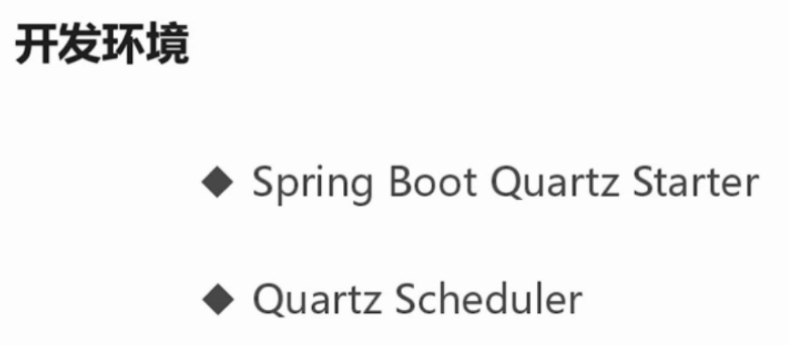
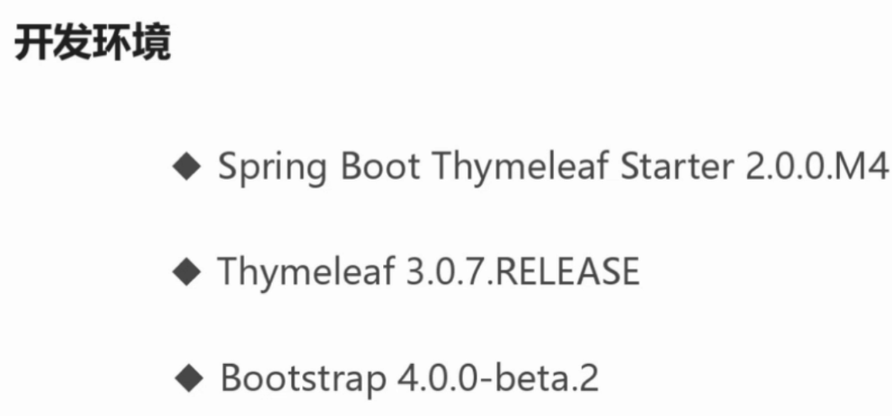
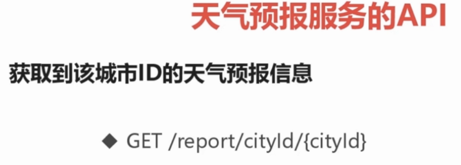
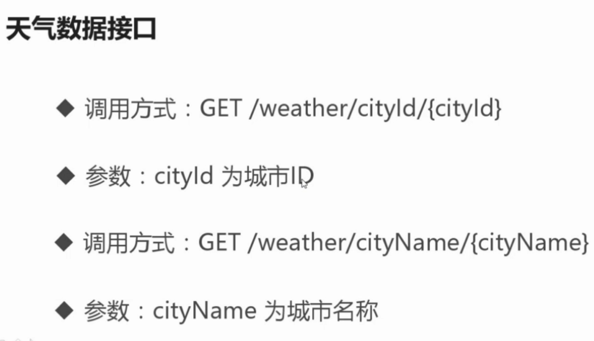
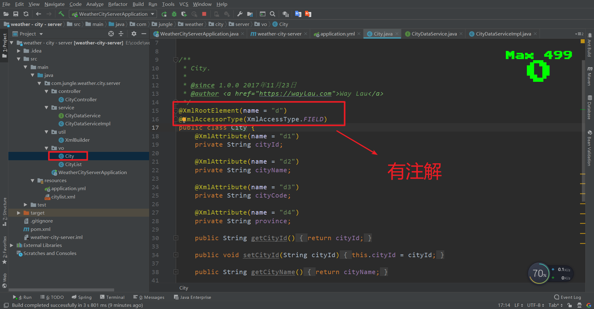
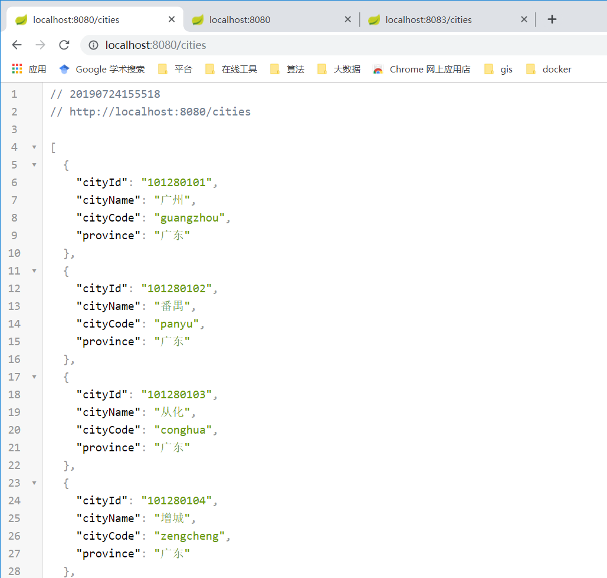
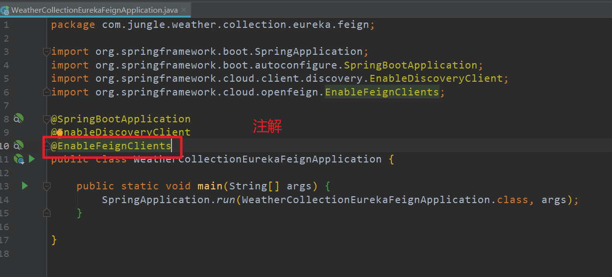
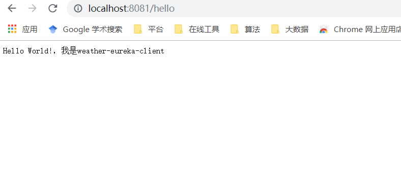
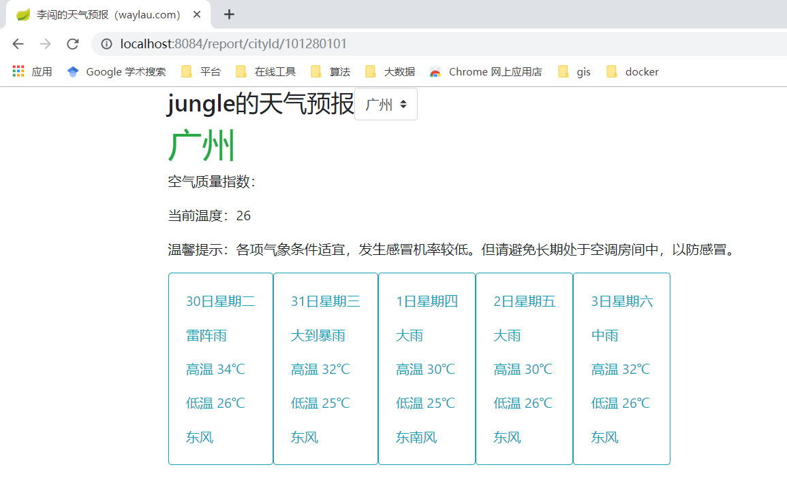
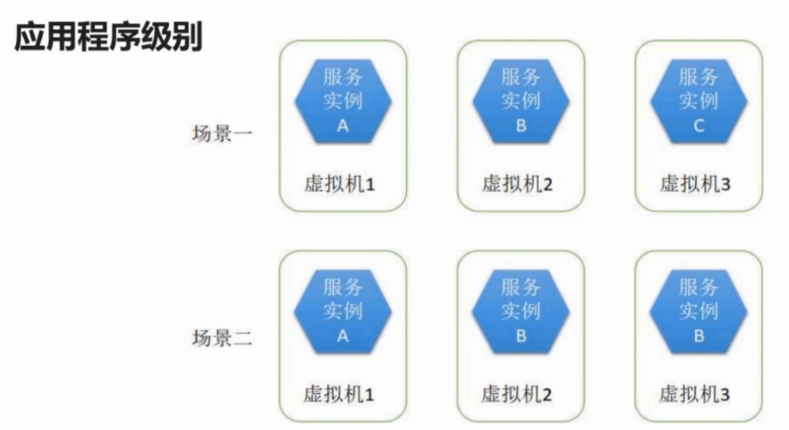

# 第1章 基于Spring Boot快速构建天气预报系统

## 一、天气预报系统

### 1.数据来源


```
http://wthrcdn.etouch.cn/weather_mini?city=上海
http://wthrcdn.etouch.cn/WeatherApi?city=北京
http://mobile.weather.com.cn/js/citylist.xml
```

### 2.url获取json

==使用HttpClient==

+ 增加依赖[Apache HttpClient](https://mvnrepository.com/artifact/org.apache.httpcomponents/httpclient) 

```xml
<!-- https://mvnrepository.com/artifact/org.apache.httpcomponents/httpclient -->
<dependency>
    <groupId>org.apache.httpcomponents</groupId>
    <artifactId>httpclient</artifactId>
    <version>4.5.9</version>
</dependency>
```

--==url==`http://wthrcdn.etouch.cn/weather_mini?city=上海`获取的json数据

```json
{
   "data":{
      "yesterday":{
         "date":"6日星期六",
         "high":"高温 31℃",
         "fx":"东南风",
         "low":"低温 24℃",
         "fl":"<![CDATA[<3级]]>",
         "type":"多云"
      },
      "city":"上海",
      "forecast":[
         {
            "date":"7日星期天",
            "high":"高温 31℃",
            "fengli":"<![CDATA[<3级]]>",
            "low":"低温 24℃",
            "fengxiang":"西风",
            "type":"多云"
         },
         {
            "date":"8日星期一",
            "high":"高温 31℃",
            "fengli":"<![CDATA[<3级]]>",
            "low":"低温 24℃",
            "fengxiang":"西北风",
            "type":"阴"
         },
         {
            "date":"9日星期二",
            "high":"高温 27℃",
            "fengli":"<![CDATA[3-4级]]>",
            "low":"低温 24℃",
            "fengxiang":"东风",
            "type":"大雨"
         },
         {
            "date":"10日星期三",
            "high":"高温 27℃",
            "fengli":"<![CDATA[3-4级]]>",
            "low":"低温 24℃",
            "fengxiang":"北风",
            "type":"小雨"
         },
         {
            "date":"11日星期四",
            "high":"高温 30℃",
            "fengli":"<![CDATA[3-4级]]>",
            "low":"低温 24℃",
            "fengxiang":"东北风",
            "type":"小雨"
         }
      ],
      "ganmao":"各项气象条件适宜，发生感冒机率较低。但请避免长期处于空调房间中，以防感冒。",
      "wendu":"29"
   },
   "status":1000,
   "desc":"OK"
}
```

### 3.根据json写出实体对象

==一定要序列化==

`implements Serializable`

+ Weather

  ```java
  package com.jungle.weather.vo;
  
  import java.io.Serializable;
  import java.util.List;
  
  /**
   * 天气信息.
   * 
   * @since 1.0.0 2017年11月21日
   * @author <a href="https://waylau.com">Way Lau</a> 
   */
  public class Weather implements Serializable {
  
  	private static final long serialVersionUID = 1L;
  	
  	private String city;
  	private String aqi;
  	private String ganmao;
  	private String wendu;
  	private Yeaterday yesterday;
  	private List<Forecast> forecast;
  	public String getCity() {
  		return city;
  	}
  	public void setCity(String city) {
  		this.city = city;
  	}
  	public String getAqi() {
  		return aqi;
  	}
  	public void setAqi(String aqi) {
  		this.aqi = aqi;
  	}
  	public String getGanmao() {
  		return ganmao;
  	}
  	public void setGanmao(String ganmao) {
  		this.ganmao = ganmao;
  	}
  	public String getWendu() {
  		return wendu;
  	}
  	public void setWendu(String wendu) {
  		this.wendu = wendu;
  	}
  	public Yeaterday getYesterday() {
  		return yesterday;
  	}
  	public void setYesterday(Yeaterday yesterday) {
  		this.yesterday = yesterday;
  	}
  	public List<Forecast> getForecast() {
  		return forecast;
  	}
  	public void setForecast(List<Forecast> forecast) {
  		this.forecast = forecast;
  	}
  
  }
  ```

+ Yeaterday

  ```java
  package com.jungle.weather.vo;
  
  import java.io.Serializable;
  
  /**
   * 昨日天气.
   * 
   * @since 1.0.0 2017年11月21日
   * @author <a href="https://waylau.com">Way Lau</a> 
   */
  public class Yeaterday implements Serializable {
  	private static final long serialVersionUID = 1L;
  	private String date;
  	private String high;
  	private String fx;
  	private String low;
  	private String fl;
  	private String type;
  	public String getDate() {
  		return date;
  	}
  	public void setDate(String date) {
  		this.date = date;
  	}
  	public String getHigh() {
  		return high;
  	}
  	public void setHigh(String high) {
  		this.high = high;
  	}
  	public String getFx() {
  		return fx;
  	}
  	public void setFx(String fx) {
  		this.fx = fx;
  	}
  	public String getLow() {
  		return low;
  	}
  	public void setLow(String low) {
  		this.low = low;
  	}
  	public String getFl() {
  		return fl;
  	}
  	public void setFl(String fl) {
  		this.fl = fl;
  	}
  	public String getType() {
  		return type;
  	}
  	public void setType(String type) {
  		this.type = type;
  	}
  }
  ```

+ Forecast

  ```java
  package com.jungle.weather.vo;
  
  import java.io.Serializable;
  
  /**
   * 未来天气.
   * 
   * @since 1.0.0 2017年11月21日
   * @author <a href="https://waylau.com">Way Lau</a> 
   */
  public class Forecast implements Serializable {
  
  	private static final long serialVersionUID = 1L;
  	private String date;
  	private String high;
  	private String fengli;
  	private String low;
  	private String fengxiang;
  	private String type;
  	public String getDate() {
  		return date;
  	}
  	public void setDate(String date) {
  		this.date = date;
  	}
  	public String getHigh() {
  		return high;
  	}
  	public void setHigh(String high) {
  		this.high = high;
  	}
  	public String getFengli() {
  		return fengli;
  	}
  	public void setFengli(String fengli) {
  		this.fengli = fengli;
  	}
  	public String getLow() {
  		return low;
  	}
  	public void setLow(String low) {
  		this.low = low;
  	}
  	public String getFengxiang() {
  		return fengxiang;
  	}
  	public void setFengxiang(String fengxiang) {
  		this.fengxiang = fengxiang;
  	}
  	public String getType() {
  		return type;
  	}
  	public void setType(String type) {
  		this.type = type;
  	}
  
  }
  ```

+ WeatherResponse

  ```java
  package com.jungle.weather.vo;
  
  import java.io.Serializable;
  
  /**
   * Weather Response.
   * 
   * @since 1.0.0 2017年11月21日
   * @author <a href="https://waylau.com">Way Lau</a> 
   */
  public class WeatherResponse implements Serializable {
  
  	private static final long serialVersionUID = 1L;
  	private Weather data;
  	private Integer status;
  	private String desc;
  	public Weather getData() {
  		return data;
  	}
  	public void setData(Weather data) {
  		this.data = data;
  	}
  	public Integer getStatus() {
  		return status;
  	}
  	public void setStatus(Integer status) {
  		this.status = status;
  	}
  	public String getDesc() {
  		return desc;
  	}
  	public void setDesc(String desc) {
  		this.desc = desc;
  	}
  	
  }
  ```

### 4.httpclient的使用

  ```java
  @Autowired
  private RestTemplate restTemplate;
  ```

+ WeatherDataServiceImpl

  ```java
  package com.jungle.weather.service;
  import java.io.IOException;
  
    import com.jungle.weather.vo.WeatherResponse;
    import org.springframework.beans.factory.annotation.Autowired;
    import org.springframework.http.ResponseEntity;
    import org.springframework.stereotype.Service;
    import org.springframework.web.client.RestTemplate;
  
    import com.fasterxml.jackson.databind.ObjectMapper;
  
    /**
     *   WeatherDataService 实现. 
     */
  
  @Service
  public class WeatherDataServiceImpl implements WeatherDataService {
  	private static final String WEATHER_URI = "http://wthrcdn.etouch.cn/weather_mini?";
      @Autowired
    	private RestTemplate restTemplate;
    	
    	@Override
    	public WeatherResponse getDataByCityId(String cityId) {
    		String uri = WEATHER_URI + "citykey=" + cityId;
    		return this.doGetWeahter(uri);
    	}
  
    	@Override
    	public WeatherResponse getDataByCityName(String cityName) {
    		String uri = WEATHER_URI + "city=" + cityName;
    		return this.doGetWeahter(uri);
    	}
    	
    	private WeatherResponse doGetWeahter(String uri) {
     		ResponseEntity<String> respString = restTemplate.getForEntity(uri, String.class);
    		
    		ObjectMapper mapper = new ObjectMapper();
    		WeatherResponse resp = null;
    		String strBody = null;
    		
    		if (respString.getStatusCodeValue() == 200) {
    			strBody = respString.getBody();
    		}
  
    		try {
    			resp = mapper.readValue(strBody, WeatherResponse.class);
    		} catch (IOException e) {
    			e.printStackTrace();
    		}
    		
    		return resp;
    	}
  
    }
  ```

+ RestConfiguration

  ​	

  ```java

  package com.jungle.weather.config;
  
  import org.springframework.beans.factory.annotation.Autowired;
  import org.springframework.boot.web.client.RestTemplateBuilder;
  import org.springframework.context.annotation.Bean;
  import org.springframework.context.annotation.Configuration;
  import org.springframework.web.client.RestTemplate;
  
  /**
   * Rest Configuration.
   * 
   * @since 1.0.0 2017年11月22日
   * @author <a href="https://waylau.com">Way Lau</a> 
   */
  @Configuration
  public class RestConfiguration {
  	
  	@Autowired
  	private RestTemplateBuilder builder;
  
  	@Bean
  	public RestTemplate restTemplate() {
  		return builder.build();
  	}
  	
  }
  ```

  

## 二、Redis提升并发访问能力


### 1.redis使用

+ 添加redis依赖

```xml
<!-- https://mvnrepository.com/artifact/org.springframework.boot/spring-boot-starter-data-redis -->
<dependency>
    <groupId>org.springframework.boot</groupId>
    <artifactId>spring-boot-starter-data-redis</artifactId>
    <version>2.1.6.RELEASE</version>
</dependency>
```

```java
# 该类对redis api做了封装
@Autowired
private StringRedisTemplate stringRedisTemplate;
```

+ 使用方法

  ```java
  ValueOperations<String, String>  ops = stringRedisTemplate.opsForValue();
  		// 先查缓存，缓存有的取缓存中的数据
  		if (stringRedisTemplate.hasKey(key)) {
  			logger.info("Redis has data");
  			strBody = ops.get(key);
  		} else {
  			logger.info("Redis don't has data");
  			// 缓存没有，再调用服务接口来获取
  	 		ResponseEntity<String> respString = restTemplate.getForEntity(uri, String.class);
  
  	 		if (respString.getStatusCodeValue() == 200) {
  				strBody = respString.getBody();
  			}
  			
  			// 数据写入缓存
  			ops.set(key, strBody, TIME_OUT, TimeUnit.SECONDS);
  		}
  ```


### 2.日志的使用
+ 引入日志

```
private final static Logger logger = LoggerFactory.getLogger(WeatherDataServiceImpl.class);
```

+ 使用

  ```java
  if (stringRedisTemplate.hasKey(key)) {
  			logger.info("Redis has data");
  			strBody = ops.get(key);
  		} else {
  			logger.info("Redis don't has data");
  			// 缓存没有，再调用服务接口来获取
  	 		ResponseEntity<String> respString = restTemplate.getForEntity(uri, String.class);
  
  	 		if (respString.getStatusCodeValue() == 200) {
  				strBody = respString.getBody();
  			}
  			
  			// 数据写入缓存
  			ops.set(key, strBody, TIME_OUT, TimeUnit.SECONDS);
  		}
  
  		try {
  			resp = mapper.readValue(strBody, WeatherResponse.class);
  		} catch (IOException e) {
  			//e.printStackTrace();
  			logger.error("Error!",e);
  		}
  ```

### 3.redis安装

```yml
version: '3.1'
services:
  master:
    image: redis
    container_name: redis-master
    ports:
      - 6379:6379
```

### 4.实践


+ 注意

  ==application.yml==

  ```yml
  spring:
    redis:
      host: 192.168.1.18
      port: 6379
  ```

+ 实现类

  ```java
  package com.jungle.weather.service;
  
  import java.io.IOException;
  import java.util.concurrent.TimeUnit;
  
  import com.jungle.weather.vo.WeatherResponse;
  import org.slf4j.Logger;
  import org.slf4j.LoggerFactory;
  import org.springframework.beans.factory.annotation.Autowired;
  import org.springframework.data.redis.core.StringRedisTemplate;
  import org.springframework.data.redis.core.ValueOperations;
  import org.springframework.http.ResponseEntity;
  import org.springframework.stereotype.Service;
  import org.springframework.web.client.RestTemplate;
  
  import com.fasterxml.jackson.databind.ObjectMapper;
  
  /**
   * WeatherDataService 实现.
   * 
   * @since 1.0.0 2017年11月22日
   * @author <a href="https://waylau.com">Way Lau</a> 
   */
  @Service
  public class WeatherDataServiceImpl implements WeatherDataService {
  	private final static Logger logger = LoggerFactory.getLogger(WeatherDataServiceImpl.class);  
  	
  	private static final String WEATHER_URI = "http://wthrcdn.etouch.cn/weather_mini?";
  
  	private static final long TIME_OUT = 1800L; // 1800s
  	
  	@Autowired
  	private RestTemplate restTemplate;
  	
  	@Autowired
  	private StringRedisTemplate stringRedisTemplate;
  	
  	@Override
  	public WeatherResponse getDataByCityId(String cityId) {
  		String uri = WEATHER_URI + "citykey=" + cityId;
  		return this.doGetWeahter(uri);
  	}
  
  	@Override
  	public WeatherResponse getDataByCityName(String cityName) {
  		String uri = WEATHER_URI + "city=" + cityName;
  		return this.doGetWeahter(uri);
  	}
  	
  	private WeatherResponse doGetWeahter(String uri) {
  		String key = uri;
  		String strBody = null;
  		ObjectMapper mapper = new ObjectMapper();
  		WeatherResponse resp = null;
  		ValueOperations<String, String>  ops = stringRedisTemplate.opsForValue();
  		// 先查缓存，缓存有的取缓存中的数据
  		if (stringRedisTemplate.hasKey(key)) {
  			logger.info("Redis has data");
  			strBody = ops.get(key);
  		} else {
  			logger.info("Redis don't has data");
  			// 缓存没有，再调用服务接口来获取
  	 		ResponseEntity<String> respString = restTemplate.getForEntity(uri, String.class);
  
  	 		if (respString.getStatusCodeValue() == 200) {
  				strBody = respString.getBody();
  			}
  			
  			// 数据写入缓存
  			ops.set(key, strBody, TIME_OUT, TimeUnit.SECONDS);
  		}
  
  		try {
  			resp = mapper.readValue(strBody, WeatherResponse.class);
  		} catch (IOException e) {
  			//e.printStackTrace();
  			logger.error("Error!",e);
  		}
  		
  		return resp;
  	}
  
  }
  ```

## 三、实现天气数据的同步

### 1.quartz的使用

  



+ 依赖

```java
<!-- https://mvnrepository.com/artifact/org.springframework.boot/spring-boot-starter-quartz -->
<dependency>
    <groupId>org.springframework.boot</groupId>
    <artifactId>spring-boot-starter-quartz</artifactId>
    <version>2.1.6.RELEASE</version>
</dependency>
```

+ 配置

  ```java
  package com.jungle.weather.config;
  
  import com.jungle.weather.job.WeatherDataSyncJob;
  import org.quartz.JobBuilder;
  import org.quartz.JobDetail;
  import org.quartz.SimpleScheduleBuilder;
  import org.quartz.Trigger;
  import org.quartz.TriggerBuilder;
  import org.springframework.context.annotation.Bean;
  import org.springframework.context.annotation.Configuration;
  
  
  /**
   * Quartz Configuration.
   * 
   * @since 1.0.0 2017年11月23日
   * @author <a href="https://waylau.com">Way Lau</a> 
   */
  @Configuration
  public class QuartzConfiguration {
  
  
  	// JobDetail
  	@Bean
  	public JobDetail weatherDataSyncJobDetail() {
  		return JobBuilder.newJob(WeatherDataSyncJob.class).withIdentity("weatherDataSyncJob")
  		.storeDurably().build();
  	}
  	
  	// Trigger
  	@Bean
  	public Trigger weatherDataSyncTrigger() {
  		//2秒执行一次
  		SimpleScheduleBuilder schedBuilder = SimpleScheduleBuilder.simpleSchedule()
  				.withIntervalInSeconds(2).repeatForever();
  		
  		return TriggerBuilder.newTrigger().forJob(weatherDataSyncJobDetail())
  				.withIdentity("weatherDataSyncTrigger").withSchedule(schedBuilder).build();
  	}
  }
  ```

+ 实现类

  ```java
  package com.jungle.weather.job;
  
  import java.util.List;
  
  import com.jungle.weather.service.WeatherDataService;
  import org.quartz.JobExecutionContext;
  import org.quartz.JobExecutionException;
  import org.slf4j.Logger;
  import org.slf4j.LoggerFactory;
  import org.springframework.beans.factory.annotation.Autowired;
  import org.springframework.scheduling.quartz.QuartzJobBean;
  
  
  /**
   * Weather Data Sync Job.
   * 
   * @since 1.0.0 2017年11月23日
   * @author <a href="https://waylau.com">Way Lau</a> 
   */
  public class WeatherDataSyncJob extends QuartzJobBean {
  	
  	private final static Logger logger = LoggerFactory.getLogger(WeatherDataSyncJob.class);  
  	
  
  	@Override
  	protected void executeInternal(JobExecutionContext context) throws JobExecutionException {
  
  		logger.info("Weather Data Sync Job. End！");
  	}
  
  }
  
  ```

+ 运行结果

  

### 2.获取城市数据

+ 存取城市列表至本地

  

+ 获取城市列表

  + 城市映射

  ==将xml中的城市映射到Javabean中==

  > 引入@XmlRootElement
  >
  > ​	    @XmlAccessorType	

  ```java
  package com.jungle.weather.vo;
  
  import javax.xml.bind.annotation.XmlAccessType;
  import javax.xml.bind.annotation.XmlAccessorType;
  import javax.xml.bind.annotation.XmlAttribute;
  import javax.xml.bind.annotation.XmlRootElement;
  
  /**
   * City.
   * 
   * @since 1.0.0 2017年11月23日
   * @author <a href="https://waylau.com">Way Lau</a> 
   */
  @XmlRootElement(name = "d")
  @XmlAccessorType(XmlAccessType.FIELD)
  public class City {
  	@XmlAttribute(name = "d1")
  	private String cityId;
  	
  	@XmlAttribute(name = "d2")
  	private String cityName;
  	
  	@XmlAttribute(name = "d3")
  	private String cityCode;
  	
  	@XmlAttribute(name = "d4")
  	private String province;
  
  	public String getCityId() {
  		return cityId;
  	}
  
  	public void setCityId(String cityId) {
  		this.cityId = cityId;
  	}
  
  	public String getCityName() {
  		return cityName;
  	}
  
  	public void setCityName(String cityName) {
  		this.cityName = cityName;
  	}
  
  	public String getCityCode() {
  		return cityCode;
  	}
  
  	public void setCityCode(String cityCode) {
  		this.cityCode = cityCode;
  	}
  
  	public String getProvince() {
  		return province;
  	}
  
  	public void setProvince(String province) {
  		this.province = province;
  	}
  }
  ```

  

  + 城市列表

```java
package com.jungle.weather.vo;

import java.util.List;

import javax.xml.bind.annotation.XmlAccessType;
import javax.xml.bind.annotation.XmlAccessorType;
import javax.xml.bind.annotation.XmlElement;
import javax.xml.bind.annotation.XmlRootElement;

/**
 * City List.
 * 
 * @since 1.0.0 2017年11月23日
 * @author <a href="https://waylau.com">Way Lau</a> 
 */
@XmlRootElement(name = "c")
@XmlAccessorType(XmlAccessType.FIELD)
public class CityList {
	@XmlElement(name = "d")
	private List<City> cityList;

	public List<City> getCityList() {
		return cityList;
	}

	public void setCityList(List<City> cityList) {
		this.cityList = cityList;
	}
}
```


+ 工具类

  ==将XML转为指定的POJO==
  
  ```java
  package com.jungle.weather.util;
  
  import java.io.Reader;
  import java.io.StringReader;
  
  import javax.xml.bind.JAXBContext;
  import javax.xml.bind.Unmarshaller;
  
  /**
   * Xml Builder.
   * 
   * @since 1.0.0 2017年11月23日
   * @author <a href="https://waylau.com">Way Lau</a> 
   */
  public class XmlBuilder {
  
  	/**
  	 * 将XML转为指定的POJO
  	 * @param clazz
  	 * @param xmlStr
  	 * @return
  	 * @throws Exception
  	 */
  	public static Object xmlStrToOject(Class<?> clazz, String xmlStr) throws Exception {
  		Object xmlObject = null;
  		Reader reader = null;
  		JAXBContext context = JAXBContext.newInstance(clazz);
  		
  		// XML 转为对象的接口
  		Unmarshaller unmarshaller = context.createUnmarshaller();
  		
  		reader = new StringReader(xmlStr);
  		xmlObject = unmarshaller.unmarshal(reader);
  		
  		if (null != reader) {
  			reader.close();
  		}
  		
  		return xmlObject;
  	}
  }
  ```
  
  

+ 业务实现

  + 接口

    ```java
    package com.jungle.weather.service;
    
    import com.jungle.weather.vo.City;
    
    import java.util.List;
    
    
    /**
     * City Data Service.
     * 
     * @since 1.0.0 2017年11月23日
     * @author <a href="https://waylau.com">Way Lau</a> 
     */
    public interface CityDataService {
    
    	/**
    	 * 获取City列表
    	 * @return
    	 * @throws Exception
    	 */
    	List<City> listCity() throws Exception;
    }
    
    ```

    

    ​        

  + 实现
  
    ```java
    package com.jungle.weather.service;
    
    import java.io.BufferedReader;
    import java.io.InputStreamReader;
    import java.util.List;
    
    import com.jungle.weather.util.XmlBuilder;
    import com.jungle.weather.vo.City;
    import com.jungle.weather.vo.CityList;
    import org.springframework.core.io.ClassPathResource;
    import org.springframework.core.io.Resource;
    import org.springframework.stereotype.Service;
    
    
    /**
     * City Data Service.
     * 
     * @since 1.0.0 2017年11月23日
     * @author <a href="https://waylau.com">Way Lau</a> 
     */
    @Service
    public class CityDataServiceImpl implements CityDataService {
    
    	@Override
    	public List<City> listCity() throws Exception {
    		// 读取XML文件
    		Resource resource = new ClassPathResource("citylist.xml");
    		BufferedReader br = new BufferedReader(new InputStreamReader(resource.getInputStream(), "utf-8"));
    		StringBuffer buffer = new StringBuffer();
    		String line = "";
    		
    		while ((line = br.readLine()) !=null) {
    			buffer.append(line);
    		}
    		
    		br.close();
    		
    		// XML转为Java对象
    		CityList cityList = (CityList) XmlBuilder.xmlStrToOject(CityList.class, buffer.toString());
    		return cityList.getCityList();
    	}
    
    }
    ```
  
    

### 3.实现天气数据同步

+ 增加接口

```java
/**
	 * 根据城市ID来同步天气
	 * @param cityId
	 */
	void syncDateByCityId(String cityId);
```


+ 实现

  ```java
  	@Override
  	public void syncDateByCityId(String cityId) {
  		String uri = WEATHER_URI + "citykey=" + cityId;
  		this.saveWeatherData(uri);
  	}
  	
  	/**
  	 * 把天气数据放在缓存
  	 * @param uri
  	 */
  	private void saveWeatherData(String uri) {
  		String key = uri;
  		String strBody = null;
  		ValueOperations<String, String>  ops = stringRedisTemplate.opsForValue();
  
  		// 调用服务接口来获取
   		ResponseEntity<String> respString = restTemplate.getForEntity(uri, String.class);
  
   		if (respString.getStatusCodeValue() == 200) {
  			strBody = respString.getBody();
  		}
  		
  		// 数据写入缓存
  		ops.set(key, strBody, TIME_OUT, TimeUnit.SECONDS);
  
  	}
  ```

  

+ 同步（quartz）

  ```java
  package com.jungle.weather.job;
  
  import com.jungle.weather.service.CityDataService;
  import com.jungle.weather.service.WeatherDataService;
  import com.jungle.weather.vo.City;
  import org.quartz.JobExecutionContext;
  import org.quartz.JobExecutionException;
  import org.slf4j.Logger;
  import org.slf4j.LoggerFactory;
  import org.springframework.beans.factory.annotation.Autowired;
  import org.springframework.scheduling.quartz.QuartzJobBean;
  
  import java.util.List;
  
  
  /**
   * Weather Data Sync Job.
   *
   * @since 1.0.0 2017年11月23日
   * @author <a href="https://waylau.com">Way Lau</a> 
   */
  public class WeatherDataSyncJob extends QuartzJobBean {
  
  	private final static Logger logger = LoggerFactory.getLogger(WeatherDataSyncJob.class);
  
  	@Autowired
  	private CityDataService cityDataService;
  
  	@Autowired
  	private WeatherDataService weatherDataService;
  	/* (non-Javadoc)
  	 * @see org.springframework.scheduling.quartz.QuartzJobBean#executeInternal(org.quartz.JobExecutionContext)
  	 */
  	@Override
  	protected void executeInternal(JobExecutionContext context) throws JobExecutionException {
  		logger.info("Weather Data Sync Job. Start！");
  		// 获取城市ID列表
  		List<City> cityList = null;
  
  		try {
  			cityList = cityDataService.listCity();
  		} catch (Exception e) {
  			logger.error("Exception!", e);
  		}
  
  		// 遍历城市ID获取天气
  		for (City city : cityList) {
  			String cityId = city.getCityId();
  			logger.info("Weather Data Sync Job, cityId:" + cityId);
  
  			weatherDataService.syncDateByCityId(cityId);
  		}
  
  		logger.info("Weather Data Sync Job. End！");
  	}
  
  }
  ```

  

  + 配置

    ```java
    package com.jungle.weather.config;
    
    import com.jungle.weather.job.WeatherDataSyncJob;
    import org.quartz.JobBuilder;
    import org.quartz.JobDetail;
    import org.quartz.SimpleScheduleBuilder;
    import org.quartz.Trigger;
    import org.quartz.TriggerBuilder;
    import org.springframework.context.annotation.Bean;
    import org.springframework.context.annotation.Configuration;
    
    
    /**
     * Quartz Configuration.
     *
     * @since 1.0.0 2017年11月23日
     * @author <a href="https://waylau.com">Way Lau</a> 
     */
    @Configuration
    public class QuartzConfiguration {
    
    	private static final int TIME = 1800; // 更新频率
    
    	// JobDetail
    	@Bean
    	public JobDetail weatherDataSyncJobDetail() {
    		return JobBuilder.newJob(WeatherDataSyncJob.class).withIdentity("weatherDataSyncJob")
    				.storeDurably().build();
    	}
    
    	// Trigger
    	@Bean
    	public Trigger weatherDataSyncTrigger() {
    
    		SimpleScheduleBuilder schedBuilder = SimpleScheduleBuilder.simpleSchedule()
    				.withIntervalInSeconds(TIME).repeatForever();
    
    		return TriggerBuilder.newTrigger().forJob(weatherDataSyncJobDetail())
    				.withIdentity("weatherDataSyncTrigger").withSchedule(schedBuilder).build();
    	}
    }
    ```

    

---

==注意：==

```
注解@XmlElement，@XmlAttribute的区别
```

## 四、集成thymeleaf







### 1.后端程序

+ 添加依赖

  ```xml
  <dependency>
              <groupId>org.springframework.boot</groupId>
              <artifactId>spring-boot-starter-thymeleaf</artifactId>
  </dependency>
  ```

+ 接口

  ```java
  package com.jungle.weather.service;
  
  
  import com.jungle.weather.vo.Weather;
  
  /**
   * Weather Report Service.
   * 
   * @since 1.0.0 2017年11月24日
   * @author <a href="https://waylau.com">Way Lau</a> 
   */
  public interface WeatherReportService {
  
  	/**
  	 * 根据城市ID查询天气信息
  	 * @param cityId
  	 * @return
  	 */
  	Weather getDataByCityId(String cityId);
  }
  
  ```

+ 实现

  ```java
  package com.jungle.weather.service;
  
  import com.jungle.weather.vo.Weather;
  import com.jungle.weather.vo.WeatherResponse;
  import org.springframework.beans.factory.annotation.Autowired;
  import org.springframework.stereotype.Service;
  
  
  /**
   * Weather Report Service.
   * 
   * @since 1.0.0 2017年11月24日
   * @author <a href="https://waylau.com">Way Lau</a> 
   */
  @Service
  public class WeatherReportServiceImpl implements WeatherReportService {
  	@Autowired
  	private WeatherDataService  weatherDataService;
  	
  	@Override
  	public Weather getDataByCityId(String cityId) {
  		WeatherResponse resp = weatherDataService.getDataByCityId(cityId);
  		return resp.getData();
  	}
  
  }
  ```

+ 控制层

  ==springMVC==

```java
# 将界面响应给用户（ModelAndView
public ModelAndView getReportByCityId(@PathVariable("cityId") String cityId, Model model) throws Exception {
		model.addAttribute("title", "老卫的天气预报");
		model.addAttribute("cityId", cityId);
		model.addAttribute("cityList", cityDataService.listCity());
		model.addAttribute("report", weatherReportService.getDataByCityId(cityId));
		# 视图（界面名称），模型名称，模型
		return new ModelAndView("weather/report", "reportModel", model);
	}）
```

​    ==具体代码==

```java
package com.jungle.weather.controller;

import com.jungle.weather.service.CityDataService;
import com.jungle.weather.service.WeatherReportService;
import org.springframework.beans.factory.annotation.Autowired;
import org.springframework.ui.Model;
import org.springframework.web.bind.annotation.GetMapping;
import org.springframework.web.bind.annotation.PathVariable;
import org.springframework.web.bind.annotation.RequestMapping;
import org.springframework.web.bind.annotation.RestController;
import org.springframework.web.servlet.ModelAndView;

/**
 * Weather Report Controller.
 * 
 * @since 1.0.0 2017年11月24日
 * @author <a href="https://waylau.com">Way Lau</a> 
 */
@RestController
@RequestMapping("/report")
public class WeatherReportController {
	@Autowired
	private CityDataService cityDataService;
	
	@Autowired
	private WeatherReportService weatherReportService;
	
	@GetMapping("/cityId/{cityId}")
	public ModelAndView getReportByCityId(@PathVariable("cityId") String cityId, Model model) throws Exception {
		model.addAttribute("title", "老卫的天气预报");
		model.addAttribute("cityId", cityId);
		model.addAttribute("cityList", cityDataService.listCity());
		model.addAttribute("report", weatherReportService.getDataByCityId(cityId));
		return new ModelAndView("weather/report", "reportModel", model);
	}

}
```


### 2.前端页面


+ 设置

  ```yaml
  # 热部署静态文件
    thymeleaf:
      cache: false
  ```

  

+ html

  ```html
  <!DOCTYPE html>
  <html xmlns:th="http://www.w3.org/1999/xhtml">
  <head>
  <meta charset="UTF-8">
  <meta name="viewport"
  	content="width=device-width, initial-scale=1, shrink-to-fit=no">
  <!-- Bootstrap CSS -->
  <link rel="stylesheet"
  	href="https://maxcdn.bootstrapcdn.com/bootstrap/4.0.0-beta.2/css/bootstrap.min.css"
  	integrity="sha384-PsH8R72JQ3SOdhVi3uxftmaW6Vc51MKb0q5P2rRUpPvrszuE4W1povHYgTpBfshb"
  	crossorigin="anonymous">
  
  <title>李闯的天气预报（waylau.com）</title>
  </head>
  <body>
  	<div class="container">
  		<div class="row">
  			<h3 th:text="${reportModel.title}">jungle</h3>
  			<select class="custom-select" id="selectCityId">
  				<option th:each="city : ${reportModel.cityList}"
  					th:value="${city.cityId}" th:text="${city.cityName}"
  					th:selected="${city.cityId eq reportModel.cityId}"></option>
  			</select>
  		</div>
  		<div class="row">
  			<h1 class="text-success" th:text="${reportModel.report.city}">深圳</h1>
  		</div>
  		<div class="row">
  			<p>
  				空气质量指数：<span th:text="${reportModel.report.aqi}"></span>
  			</p>
  		</div>
  		<div class="row">
  			<p>
  				当前温度：<span th:text="${reportModel.report.wendu}"></span>
  			</p>
  		</div>
  		<div class="row">
  			<p>
  				温馨提示：<span th:text="${reportModel.report.ganmao}"></span>
  			</p>
  		</div>
  		<div class="row">
  			<div class="card border-info" th:each="forecast : ${reportModel.report.forecast}">
  				<div class="card-body text-info">
  					<p class ="card-text" th:text="${forecast.date}">日期</p>
  					<p class ="card-text" th:text="${forecast.type}">天气类型</p>
  					<p class ="card-text" th:text="${forecast.high}">最高温度</p>
  					<p class ="card-text" th:text="${forecast.low}">最低温度</p>
  					<p class ="card-text" th:text="${forecast.fengxiang}">风向</p>
  				</div>
  			</div>
  		</div>
  </body>
  </html>
  ```

  

## 五、集成bootstrap

+ 引用bootstrap

```html
<meta name="viewport" content="width=device-width, initial-scale=1.0">
      <!-- 引入 Bootstrap -->
      <link href="https://maxcdn.bootstrapcdn.com/bootstrap/css/bootstrap.min.css" rel="stylesheet">


<!-- jQuery first, then Popper.js, then Bootstrap JS -->
	<script src="https://code.jquery.com/jquery-3.2.1.slim.min.js"
		integrity="sha384-KJ3o2DKtIkvYIK3UENzmM7KCkRr/rE9/Qpg6aAZGJwFDMVNA/GpGFF93hXpG5KkN"
		crossorigin="anonymous"></script>
	<script
		src="https://cdnjs.cloudflare.com/ajax/libs/popper.js/1.12.3/umd/popper.min.js"
		integrity="sha384-vFJXuSJphROIrBnz7yo7oB41mKfc8JzQZiCq4NCceLEaO4IHwicKwpJf9c9IpFgh"
		crossorigin="anonymous"></script>
	<script
		src="https://maxcdn.bootstrapcdn.com/bootstrap/4.0.0-beta.2/js/bootstrap.min.js"
		integrity="sha384-alpBpkh1PFOepccYVYDB4do5UnbKysX5WZXm3XxPqe5iKTfUKjNkCk9SaVuEZflJ"
		crossorigin="anonymous"></script>
```

+ 引入bootstrap样式

  ```html
  <div class="container">
  <div class="row">
  ```
<div class="card border-info" th:each="forecast : ${reportModel.report.forecast}">
  ```

+ ==注意==

  ```
  jquery须放置在JavaScript的前面
  ```


# 第2章 服务拆分与业务建模

## 一、单块架构的概念及优缺点


## 二、单块架构转为微服务架构

### 1.微服务设计原则


### 2.微服务的拆分方法


# 第4章 天气预报系统的微服务架构设计与实现

## 一、微服务架构设计

### 1.服务拆分


### 2.数据流向


### 3.通信设计





### 4.存储设计


## 二、天气数据采集微服务的实现

### 1.开发环境


### 2.新建项目

+ 引入依赖

  ```xml
  <dependencies>
      <dependency>
              <groupId>org.springframework.boot</groupId>
              <artifactId>spring-boot-starter-web</artifactId>
          </dependency>
  
          <dependency>
              <groupId>org.springframework.boot</groupId>
              <artifactId>spring-boot-starter-test</artifactId>
              <scope>test</scope>
          </dependency>
          <!-- https://mvnrepository.com/artifact/org.apache.httpcomponents/httpclient -->
          <dependency>
              <groupId>org.apache.httpcomponents</groupId>
              <artifactId>httpclient</artifactId>
              <version>4.5.9</version>
          </dependency>
  
          <!-- https://mvnrepository.com/artifact/org.springframework.boot/spring-boot-starter-data-redis -->
          <dependency>
              <groupId>org.springframework.boot</groupId>
              <artifactId>spring-boot-starter-data-redis</artifactId>
              <version>2.1.6.RELEASE</version>
          </dependency>
          
          <!-- https://mvnrepository.com/artifact/org.springframework.boot/spring-boot-starter-quartz -->
          <dependency>
              <groupId>org.springframework.boot</groupId>
              <artifactId>spring-boot-starter-quartz</artifactId>
              <version>2.1.6.RELEASE</version>
          </dependency>
      </dependencies>
  ```

+ 目录结构


### 3.配置文件

+ QuartzConfiguration

  ```java
  package com.jungle.weather.collection.server.config;
  
  		import com.jungle.weather.collection.server.job.WeatherDataSyncJob;
  		import org.quartz.JobBuilder;
  		import org.quartz.JobDetail;
  		import org.quartz.SimpleScheduleBuilder;
  		import org.quartz.Trigger;
  		import org.quartz.TriggerBuilder;
  		import org.springframework.context.annotation.Bean;
  		import org.springframework.context.annotation.Configuration;
  
  
  /**
   * Quartz Configuration.
   *
   * @since 1.0.0 2017年11月23日
   * @author <a href="https://waylau.com">Way Lau</a>
   */
  @Configuration
  public class QuartzConfiguration {
  
  	private static final int TIME = 1800; // 更新频率
  
  	// JobDetail
  	@Bean
  	public JobDetail weatherDataSyncJobDetail() {
  		return JobBuilder.newJob(WeatherDataSyncJob.class).withIdentity("weatherDataSyncJob")
  				.storeDurably().build();
  	}
  
  	// Trigger
  	@Bean
  	public Trigger weatherDataSyncTrigger() {
  
  		SimpleScheduleBuilder schedBuilder = SimpleScheduleBuilder.simpleSchedule()
  				.withIntervalInSeconds(TIME).repeatForever();
  
  		return TriggerBuilder.newTrigger().forJob(weatherDataSyncJobDetail())
  				.withIdentity("weatherDataSyncTrigger").withSchedule(schedBuilder).build();
  	}
  }
  
  ```

+ RestConfiguration

  ```java
  package com.jungle.weather.collection.server.config;
  
  import org.springframework.beans.factory.annotation.Autowired;
  import org.springframework.boot.web.client.RestTemplateBuilder;
  import org.springframework.context.annotation.Bean;
  import org.springframework.context.annotation.Configuration;
  import org.springframework.web.client.RestTemplate;
  
  /**
   * Rest Configuration.
   *
   *
   * @since 1.0.0 2017年11月22日
   * @author <a href="https://waylau.com">Way Lau</a>
   */
  @Configuration
  public class RestConfiguration {
  
  	@Autowired
  	private RestTemplateBuilder builder;
  
  	@Bean
  	public RestTemplate restTemplate() {
  		return builder.build();
  	}
  
  }
  
  ```

### 4.定时任务

  ```java
  package com.jungle.weather.collection.server.job;
  
  		import com.jungle.weather.collection.server.service.WeatherDataCollectionService;
  		import com.jungle.weather.collection.server.vo.City;
  		import org.quartz.JobExecutionContext;
  		import org.quartz.JobExecutionException;
  		import org.slf4j.Logger;
  		import org.slf4j.LoggerFactory;
  		import org.springframework.beans.factory.annotation.Autowired;
  		import org.springframework.scheduling.quartz.QuartzJobBean;
  
  		import java.util.ArrayList;
  		import java.util.List;
  
  
  /**
   * Weather Data Sync Job.
   *
   * @since 1.0.0 2017年11月23日
   * @author <a href="https://waylau.com">Way Lau</a>
   */
  public class WeatherDataSyncJob extends QuartzJobBean {
  
  	private final static Logger logger = LoggerFactory.getLogger(WeatherDataSyncJob.class);
  
  
  	@Autowired
  	private WeatherDataCollectionService weatherDataCollectionService;
  	/* (non-Javadoc)
  	 * @see org.springframework.scheduling.quartz.QuartzJobBean#executeInternal(org.quartz.JobExecutionContext)
  	 */
  	@Override
  	protected void executeInternal(JobExecutionContext context) throws JobExecutionException {
  		logger.info("Weather Data Sync Job. Start！");
  		// 获取城市ID列表
  		//TODO 改为由城市API微服务来提供数据
  		List<City> cityList = null;
  
  		try {
  			// TODO 改为由城市数据API微服务来提供数据
  			//暂时先写死，后续会修改代码的
  			cityList = new ArrayList<>();
  			City city = new City();
  			city.setCityId("101280601");
  			cityList.add(city);
  		} catch (Exception e) {
  			logger.error("Exception!", e);
  		}
  
  		// 遍历城市ID获取天气
  		for (City city : cityList) {
  			String cityId = city.getCityId();
  			logger.info("Weather Data Sync Job, cityId:" + cityId);
  
  			weatherDataCollectionService.syncDateByCityId(cityId);
  		}
  
  		logger.info("Weather Data Sync Job. End！");
  	}
  
  }
  
  ```

  

### 5.业务逻辑

+ 接口

  ```java
  package com.jungle.weather.collection.server.service;
  
  /**
   * Weather Data Collection Service.
   * 
   * @since 1.0.0 2017年11月26日
   * @author <a href="https://waylau.com">Way Lau</a> 
   */
  public interface WeatherDataCollectionService {
  
  	/**
  	 * 根据城市ID同步天气
  	 * @param cityId
  	 */
  	void syncDateByCityId(String cityId);
  }
  
  ```

+ 实现

  ```java
  package com.jungle.weather.collection.server.service;
  
  import java.util.concurrent.TimeUnit;
  
  import org.springframework.beans.factory.annotation.Autowired;
  import org.springframework.data.redis.core.StringRedisTemplate;
  import org.springframework.data.redis.core.ValueOperations;
  import org.springframework.http.ResponseEntity;
  import org.springframework.stereotype.Service;
  import org.springframework.web.client.RestTemplate;
  
  /**
   * Weather Data Collection Service.
   * 
   */
  @Service
  public class WeatherDataCollectionServiceImpl implements WeatherDataCollectionService {
  	private static final String WEATHER_URI = "http://wthrcdn.etouch.cn/weather_mini?";
  
  	private static final long TIME_OUT = 1800L; // 1800s
  
  	@Autowired
  	private RestTemplate restTemplate;
  
  	@Autowired
  	private StringRedisTemplate stringRedisTemplate;
  	@Override
  	public void syncDateByCityId(String cityId) {
  		String uri = WEATHER_URI + "citykey=" + cityId;
  		this.saveWeatherData(uri);
  	}
  
  	/**
  	 * 把天气数据放在缓存
  	 * @param uri
  	 */
  	private void saveWeatherData(String uri) {
  		String key = uri;
  		String strBody = null;
  		ValueOperations<String, String>  ops = stringRedisTemplate.opsForValue();
  
  		// 调用服务接口来获取
  		ResponseEntity<String> respString = restTemplate.getForEntity(uri, String.class);
  
  		if (respString.getStatusCodeValue() == 200) {
  			strBody = respString.getBody();
  		}
  
  		// 数据写入缓存
  		ops.set(key, strBody, TIME_OUT, TimeUnit.SECONDS);
  
  	}
  }
  
  ```

### 6.实体类

+ City

  ```java
  package com.jungle.weather.collection.server.vo;
  
  import javax.xml.bind.annotation.XmlAccessType;
  import javax.xml.bind.annotation.XmlAccessorType;
  import javax.xml.bind.annotation.XmlAttribute;
  import javax.xml.bind.annotation.XmlRootElement;
  
  
  /**
   * City.
   * 
   * @since 1.0.0 2017年11月23日
   * @author <a href="https://waylau.com">Way Lau</a> 
   */
  
  public class City {
  	private String cityId;
  	
  	private String cityName;
  	
  	private String cityCode;
  	
  	private String province;
  
  	public String getCityId() {
  		return cityId;
  	}
  
  	public void setCityId(String cityId) {
  		this.cityId = cityId;
  	}
  
  	public String getCityName() {
  		return cityName;
  	}
  
  	public void setCityName(String cityName) {
  		this.cityName = cityName;
  	}
  
  	public String getCityCode() {
  		return cityCode;
  	}
  
  	public void setCityCode(String cityCode) {
  		this.cityCode = cityCode;
  	}
  
  	public String getProvince() {
  		return province;
  	}
  
  	public void setProvince(String province) {
  		this.province = province;
  	}
  }
  
  ```

  ==不需要加任何注释进行对xml文件进行映射==

### 7.Redis配置

  ```yml
  spring:
    redis:
      host: 192.168.1.18
      port: 6379
  
  ```

  


## 三、天气数据api微服务的实现

### 1.目录结构


### 2.pom.xml

+ 引入依赖

  ```xml
  <dependency>
              <groupId>org.springframework.boot</groupId>
              <artifactId>spring-boot-starter-web</artifactId>
          </dependency>
  
          <dependency>
              <groupId>org.springframework.boot</groupId>
              <artifactId>spring-boot-starter-test</artifactId>
              <scope>test</scope>
          </dependency>
      <!-- https://mvnrepository.com/artifact/org.springframework.boot/spring-boot-starter-data-redis -->
          <dependency>
              <groupId>org.springframework.boot</groupId>
              <artifactId>spring-boot-starter-data-redis</artifactId>
              <version>2.1.6.RELEASE</version>
          </dependency>
  ```

### 3.控制层

```java
package com.jungle.weather.data.server.controller;

import com.jungle.weather.data.server.vo.WeatherResponse;
import com.jungle.weather.data.server.service.WeatherDataService;
import org.springframework.beans.factory.annotation.Autowired;
import org.springframework.web.bind.annotation.GetMapping;
import org.springframework.web.bind.annotation.PathVariable;
import org.springframework.web.bind.annotation.RequestMapping;
import org.springframework.web.bind.annotation.RestController;

/**
 * Weather Controller.
 * 
 * @since 1.0.0 2017年11月22日
 * @author <a href="https://waylau.com">Way Lau</a> 
 */
@RestController
@RequestMapping("/weather")
public class WeatherController {
	@Autowired
	private WeatherDataService weatherDataService;
	
	@GetMapping("/cityId/{cityId}")
	public WeatherResponse getWeatherByCityId(@PathVariable("cityId") String cityId) {
		return weatherDataService.getDataByCityId(cityId);
	}
	
	@GetMapping("/cityName/{cityName}")
	public WeatherResponse getWeatherByCityName(@PathVariable("cityName") String cityName) {
		return weatherDataService.getDataByCityName(cityName);
	}
}

```

### 4.业务逻辑层

+ 接口

  ```java
  package com.jungle.weather.data.server.service;
  
  
  import com.jungle.weather.data.server.vo.WeatherResponse;
  
  /**
   * Weather Data Service.
   * 
   * @since 1.0.0 2017年11月22日
   * @author <a href="https://waylau.com">Way Lau</a>
   */
  
  public interface WeatherDataService {
  	/**
  	 * 根据城市ID查询天气数据
  	 * 
  	 * @param cityId
  	 * @return
  	 */
  	WeatherResponse getDataByCityId(String cityId);
  
  	/**
  	 * 根据城市名称查询天气数据
  	 *
  	 * @return
  	 */
  	WeatherResponse getDataByCityName(String cityName);
  
  
  }
  ```

+ 实现

  ```java
  package com.jungle.weather.data.server.service;
  
  import java.io.IOException;
  import java.util.concurrent.TimeUnit;
  
  import com.jungle.weather.data.server.vo.WeatherResponse;
  import org.slf4j.Logger;
  import org.slf4j.LoggerFactory;
  import org.springframework.beans.factory.annotation.Autowired;
  import org.springframework.data.redis.core.StringRedisTemplate;
  import org.springframework.data.redis.core.ValueOperations;
  import org.springframework.http.ResponseEntity;
  import org.springframework.stereotype.Service;
  import org.springframework.web.client.RestTemplate;
  
  import com.fasterxml.jackson.databind.ObjectMapper;
  
  /**
   * WeatherDataService 实现.
   * 
   * @since 1.0.0 2017年11月22日
   * @author <a href="https://waylau.com">Way Lau</a> 
   */
  @Service
  public class WeatherDataServiceImpl implements WeatherDataService {
  	private final static Logger logger = LoggerFactory.getLogger(WeatherDataServiceImpl.class);
  
  	private static final String WEATHER_URI = "http://wthrcdn.etouch.cn/weather_mini?";
  
  	@Autowired
  	private StringRedisTemplate stringRedisTemplate;
  
  	@Override
  	public WeatherResponse getDataByCityId(String cityId) {
  		String uri = WEATHER_URI + "citykey=" + cityId;
  		return this.doGetWeahter(uri);
  	}
  
  	@Override
  	public WeatherResponse getDataByCityName(String cityName) {
  		String uri = WEATHER_URI + "city=" + cityName;
  		return this.doGetWeahter(uri);
  	}
  
  	private WeatherResponse doGetWeahter(String uri) {
  		String key = uri;
  		String strBody = null;
  		ObjectMapper mapper = new ObjectMapper();
  		WeatherResponse resp = null;
  		ValueOperations<String, String>  ops = stringRedisTemplate.opsForValue();
  		// 先查缓存，缓存有的取缓存中的数据
  		if (stringRedisTemplate.hasKey(key)) {
  			logger.info("Redis has data");
  			strBody = ops.get(key);
  		} else {
  			logger.info("Redis don't has data");
  			// 缓存没有，抛出异常
  			throw new RuntimeException("Don't has data!");
  		}
  
  		try {
  			resp = mapper.readValue(strBody, WeatherResponse.class);
  		} catch (IOException e) {
  			//e.printStackTrace();
  			logger.error("Error!",e);
  		}
  
  		return resp;
  	}
  
  }
  
  ```

  


### 5.实体类


### 6.resources


==运行程序==


## 四、天气预报微服务的实现


### 1.目录结构


### 2.pom.xml

+ 引入依赖

  ```xml
  <dependency>
              <groupId>org.springframework.boot</groupId>
              <artifactId>spring-boot-starter-thymeleaf</artifactId>
          </dependency>
          <dependency>
              <groupId>org.springframework.boot</groupId>
              <artifactId>spring-boot-starter-web</artifactId>
          </dependency>
  
          <dependency>
              <groupId>org.springframework.boot</groupId>
              <artifactId>spring-boot-starter-test</artifactId>
              <scope>test</scope>
          </dependency>
  ```

### 3.控制层

```java
package com.jungle.weather.report.server.controller;
import java.util.ArrayList;
import java.util.List;

import com.jungle.weather.report.server.service.WeatherReportService;
import com.jungle.weather.report.server.vo.City;
import org.slf4j.Logger;
import org.slf4j.LoggerFactory;
import org.springframework.beans.factory.annotation.Autowired;
import org.springframework.ui.Model;
import org.springframework.web.bind.annotation.GetMapping;
import org.springframework.web.bind.annotation.PathVariable;
import org.springframework.web.bind.annotation.RequestMapping;
import org.springframework.web.bind.annotation.RestController;
import org.springframework.web.servlet.ModelAndView;

/**
 * Weather Report Controller.
 *
 * @since 1.0.0 2017年11月24日
 * @author <a href="https://waylau.com">Way Lau</a>
 */
@RestController
@RequestMapping("/report")
public class WeatherReportController {
	private final static Logger logger = LoggerFactory.getLogger(WeatherReportController.class);

	@Autowired
	private WeatherReportService weatherReportService;

	@GetMapping("/cityId/{cityId}")
	public ModelAndView getReportByCityId(@PathVariable("cityId") String cityId, Model model) throws Exception {
		// 获取城市ID列表
		// TODO 改为由城市数据API微服务来提供数据
		List<City> cityList = null;

		try {

			// TODO 改为由城市数据API微服务提供数据
			//下面是造的假数据
			cityList = new ArrayList<>();
			City city = new City();
			city.setCityId("101280601");
			city.setCityName("深圳");
			cityList.add(city);

		} catch (Exception e) {
			logger.error("Exception!", e);
		}

		model.addAttribute("title", "老卫的天气预报");
		model.addAttribute("cityId", cityId);
		model.addAttribute("cityList", cityList);
		model.addAttribute("report", weatherReportService.getDataByCityId(cityId));
		return new ModelAndView("weather/report", "reportModel", model);
	}

}
```


### 4.业务逻辑层

+ 接口

  ```java
  package com.jungle.weather.report.server.service;
  
  
  import com.jungle.weather.report.server.vo.Weather;
  
  /**
   * Weather Report Service.
   * 
   * @since 1.0.0 2017年11月24日
   * @author <a href="https://waylau.com">Way Lau</a> 
   */
  public interface WeatherReportService {
  
  	/**
  	 * 根据城市ID查询天气信息
  	 * @param cityId
  	 * @return
  	 */
  	Weather getDataByCityId(String cityId);
  }
  
  ```

+ 实现

  ```java
  package com.jungle.weather.report.server.service;
  
  import com.jungle.weather.report.server.vo.Forecast;
  import com.jungle.weather.report.server.vo.Weather;
  import org.springframework.stereotype.Service;
  
  import java.util.ArrayList;
  import java.util.List;
  
  
  /**
   * Weather Report Service.
   * 
   * @since 1.0.0 2017年11月24日
   * @author <a href="https://waylau.com">Way Lau</a> 
   */
  @Service
  public class WeatherReportServiceImpl implements WeatherReportService {
  	@Override
  	public Weather getDataByCityId(String cityId) {
  		// TODO 改为由天气数据API微服务来提供
  		//暂时先造点假数据来运行该应用
  		Weather data = new Weather();
  		data.setAqi("81");
  		data.setCity("深圳");
  		data.setGanmao("容易感冒！多穿衣");
  		data.setWendu("22");
  
  		List<Forecast> forecastList = new ArrayList<>();
  
  		Forecast forecast = new Forecast();
  		forecast.setDate("25日星期天");
  		forecast.setType("晴");
  		forecast.setFengxiang("无风");
  		forecast.setHigh("高温 11度");
  		forecast.setLow("低温 1度");
  		forecastList.add(forecast);
  
  		forecast = new Forecast();
  		forecast.setDate("26日星期天");
  		forecast.setType("晴");
  		forecast.setFengxiang("无风");
  		forecast.setHigh("高温 11度");
  		forecast.setLow("低温 1度");
  		forecastList.add(forecast);
  
  		forecast = new Forecast();
  		forecast.setDate("27日星期天");
  		forecast.setType("晴");
  		forecast.setFengxiang("无风");
  		forecast.setHigh("高温 11度");
  		forecast.setLow("低温 1度");
  		forecastList.add(forecast);
  
  		forecast = new Forecast();
  		forecast.setDate("28日星期天");
  		forecast.setType("晴");
  		forecast.setFengxiang("无风");
  		forecast.setHigh("高温 11度");
  		forecast.setLow("低温 1度");
  		forecastList.add(forecast);
  
  		forecast = new Forecast();
  		forecast.setDate("29日星期天");
  		forecast.setType("晴");
  		forecast.setFengxiang("无风");
  		forecast.setHigh("高温 11度");
  		forecast.setLow("低温 1度");
  		forecastList.add(forecast);
  
  		data.setForecast(forecastList);
  		return data;
  	}
  
  }
  
  ```

  


### 5.实体类


+ city

  ```java
  package com.jungle.weather.report.server.vo;
  
  import javax.xml.bind.annotation.XmlAccessType;
  import javax.xml.bind.annotation.XmlAccessorType;
  import javax.xml.bind.annotation.XmlAttribute;
  import javax.xml.bind.annotation.XmlRootElement;
  
  
  /**
   * City.
   * 
   * @since 1.0.0 2017年11月23日
   * @author <a href="https://waylau.com">Way Lau</a> 
   */
  public class City {
  	private String cityId;
  	
  	private String cityName;
  	
  	private String cityCode;
  	
  	private String province;
  
  	public String getCityId() {
  		return cityId;
  	}
  
  	public void setCityId(String cityId) {
  		this.cityId = cityId;
  	}
  
  	public String getCityName() {
  		return cityName;
  	}
  
  	public void setCityName(String cityName) {
  		this.cityName = cityName;
  	}
  
  	public String getCityCode() {
  		return cityCode;
  	}
  
  	public void setCityCode(String cityCode) {
  		this.cityCode = cityCode;
  	}
  
  	public String getProvince() {
  		return province;
  	}
  
  	public void setProvince(String province) {
  		this.province = province;
  	}
  }
  
  ```

  ==去掉对xml映射的注解==

  ### 6.resources

  

  

+ application.yml


==运行应用==

```
http://localhost:8080/report/cityId/101280601
```


---

## 五、城市api微服务的实现

### 1.目录结构


### 2.pom.xml

+ 引入依赖

  ```xml
          <dependency>
              <groupId>org.springframework.boot</groupId>
              <artifactId>spring-boot-starter-web</artifactId>
          </dependency>
  
          <dependency>
              <groupId>org.springframework.boot</groupId>
              <artifactId>spring-boot-starter-test</artifactId>
              <scope>test</scope>
          </dependency>
  ```

### 3.控制层

```java
package com.jungle.weather.city.server.controller;


import com.jungle.weather.city.server.service.CityDataService;
import com.jungle.weather.city.server.vo.City;
import org.springframework.beans.factory.annotation.Autowired;
import org.springframework.web.bind.annotation.GetMapping;
import org.springframework.web.bind.annotation.RequestMapping;
import org.springframework.web.bind.annotation.RestController;

import java.util.List;

/**
 * Hello Controller.
 * 
 * @since 1.0.0 2017年11月20日
 * @author <a href="https://waylau.com">Way Lau</a> 
 */
@RestController
@RequestMapping("/cities")
public class CityController {
	
	@Autowired
	private CityDataService cityDataService;
	
	@GetMapping
	public List<City> listCity() throws Exception {
		return cityDataService.listCity();
	}
}

```

### 4.业务逻辑层

+ 接口

```java
package com.jungle.weather.city.server.service;

import com.jungle.weather.city.server.vo.City;

import java.util.List;


/**
 * City Data Service.
 * 
 * @since 1.0.0 2017年11月23日
 * @author <a href="https://waylau.com">Way Lau</a> 
 */
public interface CityDataService {

	/**
	 * 获取City列表
	 * @return
	 * @throws Exception
	 */
	List<City> listCity() throws Exception;
}

```

+ 实现

```java
package com.jungle.weather.city.server.service;

import java.io.BufferedReader;
import java.io.InputStreamReader;
import java.util.List;

import com.jungle.weather.city.server.util.XmlBuilder;
import com.jungle.weather.city.server.vo.City;
import com.jungle.weather.city.server.vo.CityList;
import org.springframework.core.io.ClassPathResource;
import org.springframework.core.io.Resource;
import org.springframework.stereotype.Service;


/**
 * City Data Service.
 * 
 * @since 1.0.0 2017年11月23日
 * @author <a href="https://waylau.com">Way Lau</a> 
 */
@Service
public class CityDataServiceImpl implements CityDataService {

	@Override
	public List<City> listCity() throws Exception {
		// 读取XML文件
		Resource resource = new ClassPathResource("citylist.xml");
		BufferedReader br = new BufferedReader(new InputStreamReader(resource.getInputStream(), "utf-8"));
		StringBuffer buffer = new StringBuffer();
		String line = "";
		
		while ((line = br.readLine()) !=null) {
			buffer.append(line);
		}
		
		br.close();
		
		// XML转为Java对象
		CityList cityList = (CityList) XmlBuilder.xmlStrToOject(CityList.class, buffer.toString());
		return cityList.getCityList();
	}

}
```

### 5.其他





==运行程序==

```
localhost:8080/cities
```


# 第5章 微服务的协调者Spring Cloud

## 一、spring cloud项目


## 二、服务发现的意义


## 三、集成eureka server

+ 目录结构


+ pom.xml

  ```xml
  <?xml version="1.0" encoding="UTF-8"?>
  <project xmlns="http://maven.apache.org/POM/4.0.0" xmlns:xsi="http://www.w3.org/2001/XMLSchema-instance"
           xsi:schemaLocation="http://maven.apache.org/POM/4.0.0 http://maven.apache.org/xsd/maven-4.0.0.xsd">
      <modelVersion>4.0.0</modelVersion>
      <parent>
          <groupId>org.springframework.boot</groupId>
          <artifactId>spring-boot-starter-parent</artifactId>
          <version>2.0.0.RELEASE</version>
          <relativePath/> <!-- lookup parent from repository -->
      </parent>
      <groupId>com.jungle</groupId>
      <artifactId>weather-eureka-server</artifactId>
      <version>1.0.0-SNAPSHOT</version>
      <name>weather-eureka-server</name>
      <description>Demo project for Spring Boot</description>
  
      <properties>
          <java.version>1.8</java.version>
          <!-- Spring Settings -->
          <spring-cloud.version>Finchley.RC1</spring-cloud.version>
      </properties>
  
      <dependencies>
  
          <dependency>
              <groupId>org.springframework.boot</groupId>
              <artifactId>spring-boot-starter-test</artifactId>
              <scope>test</scope>
          </dependency>
          <!-- Spring Cloud Begin -->
          <dependency>
              <groupId>org.springframework.cloud</groupId>
              <artifactId>spring-cloud-starter-eureka-server</artifactId>
              <version>1.4.4.RELEASE</version>
          </dependency>
  
          <!-- Spring Cloud End -->
  
      </dependencies>
  
      <dependencyManagement>
          <dependencies>
              <dependency>
                  <groupId>org.springframework.cloud</groupId>
                  <artifactId>spring-cloud-dependencies</artifactId>
                  <version>${spring-cloud.version}</version>
                  <type>pom</type>
                  <scope>import</scope>
              </dependency>
          </dependencies>
      </dependencyManagement>
      <build>
          <plugins>
              <plugin>
                  <groupId>org.springframework.boot</groupId>
                  <artifactId>spring-boot-maven-plugin</artifactId>
              </plugin>
          </plugins>
      </build>
  
  </project>
  
  ```

+ HelloController

  ```java
  package com.jungle.weather.eureka.server.controller;
  
  import org.springframework.web.bind.annotation.GetMapping;
  import org.springframework.web.bind.annotation.RestController;
  /**
   * Hello Controller.
   * 
   * @since 1.0.0 2017年11月20日
   * @author <a href="https://waylau.com">Way Lau</a> 
   */
  @RestController
  public class HelloController {
  
  	//@RequestMapping("/hello")
  	@GetMapping("/hello")
  	public String hello() {
  		return "Hello World!";
  	}
  }
  
  ```

+ WeatherEurekaServerApplication

  ```java
  package com.jungle.weather.eureka.server;
  
  import org.springframework.boot.SpringApplication;
  import org.springframework.boot.autoconfigure.SpringBootApplication;
  import org.springframework.cloud.netflix.eureka.server.EnableEurekaServer;
  
  @SpringBootApplication
  @EnableEurekaServer
  public class WeatherEurekaServerApplication {
  
      public static void main(String[] args) {
          SpringApplication.run(WeatherEurekaServerApplication.class, args);
      }
  
  }
  
  ```

  

+ application.yml

  ```yaml
  server:
    port: 8761
  eureka:
    instance:
      hostname: localhost
    client:
      registerWithEureka: false
      fetchRegistry: false
      serviceUrl:
        defaultZone: http://${eureka.instance.hostname}:${server.port}/eureka/
      healthcheck:
        enabled: true
  ```

  

## 四、集成eureka client

+ 目录结构


+ pom.xml

  ```xml
  <?xml version="1.0" encoding="UTF-8"?>
  <project xmlns="http://maven.apache.org/POM/4.0.0" xmlns:xsi="http://www.w3.org/2001/XMLSchema-instance"
           xsi:schemaLocation="http://maven.apache.org/POM/4.0.0 http://maven.apache.org/xsd/maven-4.0.0.xsd">
      <modelVersion>4.0.0</modelVersion>
      <parent>
          <groupId>org.springframework.boot</groupId>
          <artifactId>spring-boot-starter-parent</artifactId>
          <version>2.0.0.RELEASE</version>
          <relativePath/> <!-- lookup parent from repository -->
      </parent>
      <groupId>com.jungle</groupId>
      <artifactId>weather-eureka-client</artifactId>
      <version>1.0.0-SNAPSHOT</version>
      <name>weather-eureka-client</name>
      <description>Demo project for Spring Boot</description>
  
      <properties>
          <java.version>1.8</java.version>
          <!-- Spring Settings -->
          <spring-cloud.version>Finchley.RC1</spring-cloud.version>
      </properties>
  
      <dependencies>
  
          <dependency>
              <groupId>org.springframework.boot</groupId>
              <artifactId>spring-boot-starter-web</artifactId>
          </dependency>
          <dependency>
              <groupId>org.springframework.boot</groupId>
              <artifactId>spring-boot-starter-test</artifactId>
              <scope>test</scope>
          </dependency>
          <!-- https://mvnrepository.com/artifact/org.springframework.cloud/spring-cloud-starter-netflix-eureka-client -->
          <dependency>
              <groupId>org.springframework.cloud</groupId>
              <artifactId>spring-cloud-starter-netflix-eureka-client</artifactId>
              <version>2.0.0.RELEASE</version>
          </dependency>
  
  
          <!-- Spring Cloud End -->
  
      </dependencies>
  
      <dependencyManagement>
          <dependencies>
              <dependency>
                  <groupId>org.springframework.cloud</groupId>
                  <artifactId>spring-cloud-dependencies</artifactId>
                  <version>${spring-cloud.version}</version>
                  <type>pom</type>
                  <scope>import</scope>
              </dependency>
          </dependencies>
      </dependencyManagement>
      <build>
          <plugins>
              <plugin>
                  <groupId>org.springframework.boot</groupId>
                  <artifactId>spring-boot-maven-plugin</artifactId>
              </plugin>
          </plugins>
      </build>
  
  </project>
  
  ```

+ WeatherEurekaClientApplication

  ```java
  package com.jungle.weather.eureka.client;
  
  import org.springframework.boot.SpringApplication;
  import org.springframework.boot.autoconfigure.SpringBootApplication;
  import org.springframework.cloud.client.discovery.EnableDiscoveryClient;
  
  @SpringBootApplication
  @EnableDiscoveryClient
  public class WeatherEurekaClientApplication {
  
      public static void main(String[] args) {
          SpringApplication.run(WeatherEurekaClientApplication.class, args);
      }
  
  }
  
  ```


+ application.yml

  ```yaml
  
  eureka:
    client:
      serviceUrl:
        defaultZone: http://localhost:8761/eureka/
  spring:
    application:
      name: weather-eureka-client
  
  ```

  ==启动server,client==


## 五、实现服务的注册与发现

### 1.配置

==四个服务==

```
weather-collection-eureka
weather-data-eureka
weather-city-eureka
weather-report-eureka
```

+ 引入依赖

  ```xml
      <properties>
          <!-- Spring Settings -->
          <spring-cloud.version>Finchley.RC1</spring-cloud.version>
      </properties>
      
      
          <dependency>
              <groupId>org.springframework.cloud</groupId>
              <artifactId>spring-cloud-starter-netflix-eureka-client</artifactId>
              <version>2.0.0.RELEASE</version>
          </dependency>   
          
          
      <dependencyManagement>
          <dependencies>
              <dependency>
                  <groupId>org.springframework.cloud</groupId>
                  <artifactId>spring-cloud-dependencies</artifactId>
                  <version>${spring-cloud.version}</version>
                  <type>pom</type>
                  <scope>import</scope>
              </dependency>
          </dependencies>
      </dependencyManagement>
  ```

  ==完整pom.xml==

  ```xml
  <?xml version="1.0" encoding="UTF-8"?>
  <project xmlns="http://maven.apache.org/POM/4.0.0" xmlns:xsi="http://www.w3.org/2001/XMLSchema-instance"
           xsi:schemaLocation="http://maven.apache.org/POM/4.0.0 http://maven.apache.org/xsd/maven-4.0.0.xsd">
      <modelVersion>4.0.0</modelVersion>
      <parent>
          <groupId>org.springframework.boot</groupId>
          <artifactId>spring-boot-starter-parent</artifactId>
          <version>2.0.0.RELEASE</version>
          <relativePath/> <!-- lookup parent from repository -->
      </parent>
      <groupId>com.jungle</groupId>
      <artifactId>weather-collection-eureka</artifactId>
      <version>1.0.0-SNAPSHOT</version>
      <name>weather-collection-eureka</name>
      <description>Demo project for Spring Boot</description>
  
      <properties>
          <java.version>1.8</java.version>
          <!-- Spring Settings -->
          <spring-cloud.version>Finchley.RC1</spring-cloud.version>
      </properties>
  
      <dependencies>
          <dependency>
              <groupId>org.springframework.boot</groupId>
              <artifactId>spring-boot-starter-web</artifactId>
          </dependency>
          <dependency>
              <groupId>org.springframework.boot</groupId>
              <artifactId>spring-boot-starter-test</artifactId>
              <scope>test</scope>
          </dependency>
          <!-- https://mvnrepository.com/artifact/org.apache.httpcomponents/httpclient -->
          <dependency>
              <groupId>org.apache.httpcomponents</groupId>
              <artifactId>httpclient</artifactId>
              <version>4.5.9</version>
          </dependency>
  
          <!-- https://mvnrepository.com/artifact/org.springframework.boot/spring-boot-starter-data-redis -->
          <dependency>
              <groupId>org.springframework.boot</groupId>
              <artifactId>spring-boot-starter-data-redis</artifactId>
              <version>2.1.6.RELEASE</version>
          </dependency>
  
          <!-- https://mvnrepository.com/artifact/org.springframework.boot/spring-boot-starter-quartz -->
          <dependency>
              <groupId>org.springframework.boot</groupId>
              <artifactId>spring-boot-starter-quartz</artifactId>
              <version>2.1.6.RELEASE</version>
          </dependency>
          <dependency>
              <groupId>org.springframework.cloud</groupId>
              <artifactId>spring-cloud-starter-netflix-eureka-client</artifactId>
              <version>2.0.0.RELEASE</version>
          </dependency>
      </dependencies>
      <dependencyManagement>
          <dependencies>
              <dependency>
                  <groupId>org.springframework.cloud</groupId>
                  <artifactId>spring-cloud-dependencies</artifactId>
                  <version>${spring-cloud.version}</version>
                  <type>pom</type>
                  <scope>import</scope>
              </dependency>
          </dependencies>
      </dependencyManagement>
      <build>
          <plugins>
              <plugin>
                  <groupId>org.springframework.boot</groupId>
                  <artifactId>spring-boot-maven-plugin</artifactId>
                  <configuration>
                      <mainClass>com.jungle.weather.collection.eureka.WeatherCollectionEurekaApplication</mainClass>
                  </configuration>
              </plugin>
          </plugins>
      </build>
  
  </project>
  
  ```

+ WeatherCollectionEurekaApplication.java

  ```java
  package com.jungle.weather.collection.eureka;
  
  import org.springframework.boot.SpringApplication;
  import org.springframework.boot.autoconfigure.SpringBootApplication;
  import org.springframework.cloud.client.discovery.EnableDiscoveryClient;
  
  @SpringBootApplication
  @EnableDiscoveryClient
  public class WeatherCollectionEurekaApplication {
  
      public static void main(String[] args) {
          SpringApplication.run(WeatherCollectionEurekaApplication.class, args);
      }
  
  }
  
  ```

  

+ application.yml

  ```yaml
  spring:
    redis:
      host: 192.168.1.18
      port: 6379
    application:
      name: weather-collection-eureka
  
  eureka:
    client:
      serviceUrl:
        defaultZone: http://localhost:8761/eureka/
  server:
    port: 8081
  ```

  

```
# 端口号分别是
weather-collection-eureka  8081
weather-data-eureka        8082
weather-city-eureka        8083
weather-report-eureka      8084
```

```
# 命令行的形式设置端口号
java -jar jar包名 --server.port=8081
```

### 2.运行

1. 先开启weather-eureka-server
2. 然后依次开启四个业务服务。一个服务可以更换端口，开启多个。


# 第6章 微服务的消费

## 一、微服务的消费模式

 


## 二、常见微服务的消费者

### 1.HttpClient用法介绍


### 2.Ribbon用法介绍


### 3.Feign用法介绍

#### (1)配置

+ 引入依赖

```xml
<dependency>
            <groupId>org.springframework.cloud</groupId>
            <artifactId>spring-cloud-starter-openfeign</artifactId>
        </dependency>
```

+ WeatherEurekaClientFeignApplication


+ application.yml

  ```yaml
  
  
  eureka:
    client:
      serviceUrl:
        defaultZone: http://localhost:8761/eureka/
  spring:
    application:
      name: weather-eureka-client-feign
  
  feign:
    client:
      config:
        feignName:
          connectTimeout: 5000
          readTimeout: 5000
  
  
  ```

#### (2)程序

  

+ CityClient

  ```java
  package com.jungle.weather.eureka.client.feign.service;
  
  import org.springframework.cloud.openfeign.FeignClient;
  import org.springframework.web.bind.annotation.GetMapping;
  
  /**
   * City Client.
   * 
   */
  @FeignClient("weather-city-eureka")
  public interface CityClient {
  
  	@GetMapping("/cities")
  	String listCity();
  }
  ```

  

+ CityController

  ```java
  package com.jungle.weather.eureka.client.feign.controller;
  
  		import com.jungle.weather.eureka.client.feign.service.CityClient;
  		import org.springframework.beans.factory.annotation.Autowired;
  		import org.springframework.web.bind.annotation.GetMapping;
  		import org.springframework.web.bind.annotation.RestController;
  
  /**
   * City Controller.
   *
   */
  @RestController
  public class CityController {
  
  	@Autowired
  	private CityClient cityClient;
  
  	@GetMapping("/cities")
  	public String listCity() {
  		// 通过Feign客户端来查找
  		String body = cityClient.listCity();
  		return body;
  	}
  }
  
  ```

#### (3)运行

1. 运行weather-eureka-server

2. 运行weather-city-eureka

3. 运行weather-eureka-client-feign

   ```
   http://localhost:8080/cities
   ```

   

  ## 三、天气使用Feign


### 1.天气数据采集微服务使用Feign

#### (1)配置

+ 引入依赖

  ```xml
  <dependency>
              <groupId>org.springframework.cloud</groupId>
              <artifactId>spring-cloud-starter-openfeign</artifactId>
          </dependency>
  ```

+ 添加注解

  

+ application.yml

  ```yaml
  spring:
    redis:
      host: 192.168.1.18
      port: 6379
    application:
      name: weather-collection-eureka-feign
  
  eureka:
    client:
      serviceUrl:
        defaultZone: http://localhost:8761/eureka/
  server:
    port: 8081
  
  feign:
    client:
      config:
        feignName:
          connectTimeout: 5000
          readTimeout: 5000
  ```

  

#### (2)程序

​	==创建 Feign 接口==

+ CityClient

  ```java
  package com.jungle.weather.collection.eureka.feign.service;
  
  import java.util.List;
  
  import com.jungle.weather.collection.eureka.feign.vo.City;
  import org.springframework.cloud.openfeign.FeignClient;
  import org.springframework.web.bind.annotation.GetMapping;
  
  
  /**
   * City Client.
   * 
   */
  @FeignClient("weather-city-eureka")
  public interface CityClient {
  	
  	@GetMapping("/cities")
  	List<City> listCity() throws Exception;
  }
  
  ```

+ WeatherDataSyncJob

  ```java
  package com.jungle.weather.collection.eureka.feign.job;
  
  		import com.jungle.weather.collection.eureka.feign.service.CityClient;
  		import com.jungle.weather.collection.eureka.feign.vo.City;
          import com.jungle.weather.collection.eureka.feign.service.WeatherDataCollectionService;
          import org.quartz.JobExecutionContext;
  		import org.quartz.JobExecutionException;
  		import org.slf4j.Logger;
  		import org.slf4j.LoggerFactory;
  		import org.springframework.beans.factory.annotation.Autowired;
  		import org.springframework.scheduling.quartz.QuartzJobBean;
  
  		import java.util.ArrayList;
  		import java.util.List;
  
  
  /**
   * Weather Data Sync Job.
   *
   */
  public class WeatherDataSyncJob extends QuartzJobBean {
  
  	private final static Logger logger = LoggerFactory.getLogger(WeatherDataSyncJob.class);
  
  
  	@Autowired
  	private WeatherDataCollectionService weatherDataCollectionService;
  
  	@Autowired
  	private CityClient cityClient;
  	@Override
  	protected void executeInternal(JobExecutionContext context) throws JobExecutionException {
  		logger.info("Weather Data Sync Job. Start！");
  		// 获取城市ID列表
  		List<City> cityList = null;
  
  		try {
  			// T由城市数据API微服务来提供数据
  
  			cityList =cityClient.listCity();
  
  		} catch (Exception e) {
  			logger.error("Exception!", e);
  		}
  
  		// 遍历城市ID获取天气
  		for (City city : cityList) {
  			String cityId = city.getCityId();
  			logger.info("Weather Data Sync Job, cityId:" + cityId);
  
  			weatherDataCollectionService.syncDateByCityId(cityId);
  		}
  
  		logger.info("Weather Data Sync Job. End！");
  	}
  
  }
  
  ```

  


### 2.天气预报微服务使用Feign

#### (1)配置

+ 引入依赖

  ```xml
  <dependency>
              <groupId>org.springframework.cloud</groupId>
              <artifactId>spring-cloud-starter-openfeign</artifactId>
          </dependency>
  ```

+ 添加注解

  

+ application.yml

  ```yaml
  
  # 热部署静态文件
  spring:
    thymeleaf:
      cache: false
    application:
      name: weather-report-eureka-feign
  eureka:
    client:
      serviceUrl:
        defaultZone: http://localhost:8761/eureka/
  
  server:
    port: 8084
  
  
  feign:
    client:
      config:
        feignName:
          connectTimeout: 5000
        readTimeout: 5000
  ```
  
  

#### (2)程序


==创建 Feign 接口==

+ CityClient

  ```java
  package com.jungle.weather.report.eureka.feign.service;
  
  
  import com.jungle.weather.report.eureka.feign.vo.City;
  import org.springframework.cloud.openfeign.FeignClient;
  import org.springframework.web.bind.annotation.GetMapping;
  
  import java.util.List;
  
  
  /**
   * City Client.
   * 
   */
  @FeignClient("weather-city-eureka")
  public interface CityClient {
  	
  	@GetMapping("/cities")
  	List<City> listCity() throws Exception;
  }
  
  ```

+ WeatherDataClient

  ```scala
  package com.jungle.weather.report.eureka.feign.service;
  
  import com.jungle.weather.report.eureka.feign.vo.WeatherResponse;
  import org.springframework.cloud.openfeign.FeignClient;
  import org.springframework.web.bind.annotation.GetMapping;
  import org.springframework.web.bind.annotation.PathVariable;
  
  
  /**
   * Weather Data Client.
   * 
   */
  @FeignClient("weather-data-eureka")
  public interface WeatherDataClient {
  	
  	@GetMapping("/weather/cityId/{cityId}")
  	WeatherResponse getDataByCityId(@PathVariable("cityId") String cityId);
  }
  
  ```

==调用服务==


+ WeatherReportServiceImpl

  ```java
  package com.jungle.weather.report.eureka.feign.service;
  
  import com.jungle.weather.report.eureka.feign.vo.Forecast;
  import com.jungle.weather.report.eureka.feign.vo.Weather;
  import com.jungle.weather.report.eureka.feign.vo.WeatherResponse;
  import org.springframework.beans.factory.annotation.Autowired;
  import org.springframework.stereotype.Service;
  
  
  
  /**
   * Weather Report Service.
   * 
   */
  @Service
  public class WeatherReportServiceImpl implements WeatherReportService {
  
  	@Autowired
  	private WeatherDataClient weatherDataClient;
  	@Override
  	public Weather getDataByCityId(String cityId) {
  		WeatherResponse resp = weatherDataClient.getDataByCityId(cityId);
  		Weather data = resp.getData();
  		return data;
  	}
  
  }
  
  ```


+ WeatherReportController

  ```java
  package com.jungle.weather.report.eureka.feign.controller;
  import java.util.ArrayList;
  import java.util.List;
  
  import com.jungle.weather.report.eureka.feign.service.CityClient;
  import com.jungle.weather.report.eureka.feign.vo.City;
  import com.jungle.weather.report.eureka.feign.service.WeatherReportService;
  import org.slf4j.Logger;
  import org.slf4j.LoggerFactory;
  import org.springframework.beans.factory.annotation.Autowired;
  import org.springframework.ui.Model;
  import org.springframework.web.bind.annotation.GetMapping;
  import org.springframework.web.bind.annotation.PathVariable;
  import org.springframework.web.bind.annotation.RequestMapping;
  import org.springframework.web.bind.annotation.RestController;
  import org.springframework.web.servlet.ModelAndView;
  
  /**
   * Weather Report Controller.
   *
   * @since 1.0.0 2017年11月24日
   * @author <a href="https://waylau.com">Way Lau</a>
   */
  @RestController
  @RequestMapping("/report")
  public class WeatherReportController {
  	private final static Logger logger = LoggerFactory.getLogger(WeatherReportController.class);
  
  	@Autowired
  	private WeatherReportService weatherReportService;
  
  	@Autowired
  	private CityClient cityClient;
  
  	@GetMapping("/cityId/{cityId}")
  	public ModelAndView getReportByCityId(@PathVariable("cityId") String cityId, Model model) throws Exception {
  		// 获取城市ID列表
  		List<City> cityList = null;
  
  		try {
  
  			// 由城市数据API微服务提供数据
  			cityList=cityClient.listCity();
  
  		} catch (Exception e) {
  			logger.error("Exception!", e);
  		}
  
  		model.addAttribute("title", "老卫的天气预报");
  		model.addAttribute("cityId", cityId);
  		model.addAttribute("cityList", cityList);
  		model.addAttribute("report", weatherReportService.getDataByCityId(cityId));
  		return new ModelAndView("weather/report", "reportModel", model);
  	}
  
  }
  
  ```

  

  

## 四、实现服务的负载均衡及高可用


| weather\-eureka\-server            | 8761      |
| ---------------------------------- | --------- |
| weather\-collection\-eureka\-feign | 8081/8085 |
| weather\-data\-eureka              | 8082/8086 |
| weather\-city\-eureka              | 8083/8087 |
| weather\-report\-eureka\-feign     | 8084/8088 |

```
java -jar weather-eureka-server-1.0.0.jar --server.port=8761
```

==上述服务按照顺序开启，不要忘了开启redis==

redis ==> weather\-eureka\-server ==> weather\-city\-eureka ==>  weather\-data\-eureka ==> weather\-collection\-eureka\-feign ==> weather\-report\-eureka\-feign


# 第8章 API 网关

## 一、使用API 网关的意义


## 二、使用API网关的利与弊


## 三、常见 API 网关的实现方式

1. nginx


2. zuul

   

3. kong

   

## 四、集成Zuul


+ 引入依赖

  ```xml
   <dependency>
              <groupId>org.springframework.cloud</groupId>
              <artifactId>spring-cloud-starter-netflix-zuul</artifactId>
          </dependency>
  ```

+ 添加注解

  
  
+ aplication.yml
  
  ```yml
  spring:
    application:
      name: weather-eureka-client-zuul
  
  eureka:
    client:
      serviceUrl:
        defaultZone: http://localhost:8761/eureka/
  zuul:
    routes:
      hi:
        path: /hi/**
        serviceId: weather-eureka-client
  
  ```
  
  ==测试==
  
  1. 启动weather-eureka-server
  2. 启动weather-eureka-client  --端口8081
  3. 启动weather-eureka-client-zuul  --端口8080
  
  ```
  http://localhost:8081/hello
  ```
  
  
  
  ```
  http://localhost:8080/hello
  ```
  
  
  
  ```
  http://localhost:8080/hi/hello
  ```
  
  

## 五、API网关设计及实现


+ 新建项目

  ==msa-weather-eureka-client-zuul==(由weather-eureka-client-zuul拷贝而来)

  修改application.yml

  ```yaml
  spring:
    application:
      name: msa-weather-eureka-client-zuul
  
  eureka:
    client:
      serviceUrl:
        defaultZone: http://localhost:8761/eureka/
  zuul:
    routes:
      city:
        path: /city/**
        serviceId: weather-city-eureka
      data:
        path: /data/**
        serviceId: weather-data-eureka
  
  ```

## 六、天气预报微服务重构

新建项目==weather-report-eureka-feign-gateway==(由weather-report-eureka-feign拷贝而来)

+ application.yml

  ```yaml
  
  # 热部署静态文件
  spring:
    thymeleaf:
      cache: false
    application:
      name: weather-report-eureka-feign-gateway
  eureka:
    client:
      serviceUrl:
        defaultZone: http://localhost:8761/eureka/
  
  server:
    port: 8084
  
  
  feign:
    client:
      config:
        feignName:
          connectTimeout: 5000
          readTimeout: 5000
  ```

  

+ 新建接口

  ==之前==

  

  ==现在==

  

  ```java
  package com.jungle.weather.report.eureka.feign.gateway.service;
  
  
  import com.jungle.weather.report.eureka.feign.gateway.vo.City;
  import com.jungle.weather.report.eureka.feign.gateway.vo.WeatherResponse;
  import org.springframework.cloud.openfeign.FeignClient;
  import org.springframework.web.bind.annotation.GetMapping;
  import org.springframework.web.bind.annotation.PathVariable;
  
  import java.util.List;
  
  
  /**
   * Data Client.
   * 
   */
  @FeignClient("msa-weather-eureka-client-zuul")
  public interface DataClient {
  
  	/**
  	 * 获取城市列表
  	 * @return
  	 * @throws Exception
  	 */
  	@GetMapping("/city/cities")
  	List<City> listCity() throws Exception;
  
  	/**
  	 * 根据城市ID查询天气数据
  	 */
  	@GetMapping("/data/weather/cityId/{cityId}")
  	WeatherResponse getDataByCityId(@PathVariable("cityId") String cityId);
  }
  
  ```

+ 修改调用服务的应用

  ```
  WeatherReportController
  WeatherReportServiceImpl
  ```

  注入

```java
	@Autowired
	private DataClient dataClient;
```

## 七、运行测试重构后的系统

+ 启动

  | weather\-eureka\-server                 | 8761 |
  | --------------------------------------- | ---- |
  | weather\-city\-eureka                   | 8083 |
  | weather\-data\-eureka                   | 8082 |
  | weather\-collection\-eureka\-feign      | 8081 |
  | weather\-report\-eureka\-feign\-gateway | 8084 |
  | msa\-weather\-eureka\-client\-zuul      | 8085 |


---

# 第9章 微服务的集中化配置

## 一、集中化配置

1. 微服务为什么需要集中化配置
   ◆微服务数量多,配置多
   ◆手工管理配置繁琐

2. 配置分类
   按配置的来源划分
   ◆主要有源代码、文件、数据库连接、远程调用等

   按配置的环境划分
   ◆开发环境、测试环境、预发布环境、生产环境等

   按配置的集成阶段划分
   ◆编译时、打包时和运行时

   按配置的加載方式划分
   ◆启动加载和动态加载

3. 配置中心的要求


## 二、Config 实现 Server 端的配置中心

### 1.quickstart


### 2.正式

+ 新建项目

  ==weather-config-server==

+ 引入依赖

  ```xml
  <dependency>
              <groupId>org.springframework.cloud</groupId>
              <artifactId>spring-cloud-config-server</artifactId>
          </dependency>
  ```

+ 添加注解

  

+ application.yml

  ```yaml
  spring:
    application:
      name: weather-config-server
    cloud:
      config:
        label: master
        server:
          git:
            uri: https://github.com/junglegodlion/spring-cloud-config.git
            search-paths: respo
        
  
  
  eureka:
    client:
      serviceUrl:
        defaultZone: http://192.168.1.18:8761/eureka/
  server:
    port: 18888
  
  ```

  

  

  ```
  http://localhost:18888/test.txt/master
  ```

  

## 三、使用 Config 实现的配置中心 Client 端

### 1.概述


### 2.实战


+ 新建项目

  ==weather-config-client==

+ 引入依赖

  ```xml
  <dependency>
              <groupId>org.springframework.cloud</groupId>
              <artifactId>spring-cloud-config-client</artifactId>
          </dependency>
  ```

+ bootstrap.yml

  ==不知道为什么，这里要用bootstrap.yml不然会报错==
  
  ```yaml
  spring:
    application:
      name: weather-config-client
    cloud:
      config:
        uri: http://192.168.1.18:8888/
        profile: dev
  
  eureka:
    client:
      serviceUrl:
        defaultZone: http://192.168.1.18:8761/eureka/
  server:
    port: 8081
  
  ```

  ==WeatherConfigClientApplication==不需要添加任何注解

  
  
+ 测试

  1. GitHub下创建测试文件

      weather-config-client-dev.yml

     ```yaml
     author: jungle.com
     ```
     
     
  
  2. 测试类
  
     ==application.yml中数据传入后端代码==
  
     
     
     ```java
     package com.jungle.weather.config.client;
     
     import org.junit.Test;
     import org.junit.runner.RunWith;
     import org.springframework.beans.factory.annotation.Value;
     import org.springframework.boot.test.context.SpringBootTest;
     import org.springframework.test.context.junit4.SpringRunner;
     import static org.junit.Assert.assertEquals;
     
     @RunWith(SpringRunner.class)
     @SpringBootTest
     public class WeatherConfigClientTests {
     
         @Value("${author}")
         private String author;
         @Test
         public void contextLoads() {
             assertEquals("jungle.com",author);
         }
     
     }
  
     ```
  
     
     
     ​		
  
  

# 第10章 微服务的熔断机制

## 一、什么是服务的熔断

```
什么是服务熔断
◆对该服务的调用执行熔断,对于后续请求,不在继续调用该目标服务,而是直接返回,从而可以快速释放资源
◆保护系统
```

## 二、服务熔断的原理

## 1.方式

```
断路器
断路器模式
```


## 三、熔断的意义与功能

1. 好处
   ◆系统稳定
   ◆及时响应
   ◆减少性能损耗
   ◆阀值可定制
2. 熔断器的功能
   ◆异常处理
   ◆加速断路
   ◆手动复位
   ◆日志记录
   ◆重试失败请求
   ◆并发
   ◆测试失败的操作

## 四、熔断与降级的区别

1. 相似性
   ◆目的一致
   ◆表现类似
   ◆粒度一致
2. 主要区别
   ◆触发条件不同
   ◆管理目标的层次不同

## 五、集成 Hystrix


==新建项目weather-eureka-client-feign-hystrix==

+ 添加依赖

  ```xml
          <dependency>
              <groupId>org.springframework.cloud</groupId>
              <artifactId>spring-cloud-starter-netflix-hystrix</artifactId>
          </dependency>
  ```

+ 增加注解

  

+ CityController

  

  ```java
  package com.jungle.weather.eureka.client.feign.hystrix.controller;
  
  		import com.jungle.weather.eureka.client.feign.hystrix.service.CityClient;
  		import com.netflix.hystrix.contrib.javanica.annotation.HystrixCommand;
  		import org.springframework.beans.factory.annotation.Autowired;
  		import org.springframework.web.bind.annotation.GetMapping;
  		import org.springframework.web.bind.annotation.RestController;
  
  /**
   * City Controller.
   *
   */
  @RestController
  public class CityController {
  
  	@Autowired
  	private CityClient cityClient;
  
  	@GetMapping("/cities")
  	@HystrixCommand(fallbackMethod = "defaultCities")
  	public String listCity() {
  		// 通过Feign客户端来查找
  		String body = cityClient.listCity();
  		return body;
  	}
  
  	public String defaultCities(){
  		return "City Data Server is down";
  	}
  }
  
  ```

+ application.yml

  ```yaml
  eureka:
    client:
      serviceUrl:
        defaultZone: http://192.168.1.18:8761/eureka/
  spring:
    application:
      name: weather-eureka-client-feign-hystrix
  
  feign:
    client:
      config:
        feignName:
          connectTimeout: 5000
          readTimeout: 5000
  ```

## 六、运行测试

1. 开启weather-city-eureka

2. 开启weather-eureka-client-feign-hystrix

   

3. 关闭weather-city-eureka

   

## 七、实现天气预报微服务的熔断机制

==针对feign的另一种熔断实现方法==

​		

+ 新建项目

  ==weather-report-eureka-feign-gateway-hystrix==

+ 添加依赖

  ```XML
          <dependency>
              <groupId>org.springframework.cloud</groupId>
              <artifactId>spring-cloud-starter-netflix-hystrix</artifactId>
          </dependency>
  ```

+ 添加注解

  

+ 添加熔断

  

  ==DataClient==

  

  ```java
  package com.jungle.weather.report.eureka.feign.gateway.hystrix.service;
  
  
  import com.jungle.weather.report.eureka.feign.gateway.hystrix.vo.WeatherResponse;
  import com.jungle.weather.report.eureka.feign.gateway.hystrix.vo.City;
  import org.springframework.cloud.openfeign.FeignClient;
  import org.springframework.web.bind.annotation.GetMapping;
  import org.springframework.web.bind.annotation.PathVariable;
  
  import java.util.List;
  
  
  /**
   * Data Client.
   * 
   */
  @FeignClient(name = "msa-weather-eureka-client-zuul",fallback = DataClientFallBack.class)
  public interface DataClient {
  
  	/**
  	 * 获取城市列表
  	 * @return
  	 * @throws Exception
  	 */
  	@GetMapping("/city/cities")
  	List<City> listCity() throws Exception;
  
  	/**
  	 * 根据城市ID查询天气数据
  	 */
  	@GetMapping("/data/weather/cityId/{cityId}")
  	WeatherResponse getDataByCityId(@PathVariable("cityId") String cityId);
  }
  
  ```

+ 实现熔断类

  

  ==该类要实现DataClient接口==

  ```java
  package com.jungle.weather.report.eureka.feign.gateway.hystrix.service;
  
  import com.jungle.weather.report.eureka.feign.gateway.hystrix.vo.City;
  import com.jungle.weather.report.eureka.feign.gateway.hystrix.vo.WeatherResponse;
  import org.springframework.stereotype.Component;
  
  import java.util.ArrayList;
  import java.util.List;
  
  @Component
  public class DataClientFallBack implements DataClient{
      @Override
      public List<City> listCity() throws Exception {
          List<City> cityList = null;
          cityList = new ArrayList<>();
  
          City city = new City();
          city.setCityId("101280601");
          city.setCityName("深圳");
          cityList.add(city);
  
          city = new City();
          city.setCityId("101280301");
          city.setCityName("惠州");
          cityList.add(city);
  
          return cityList;
      }
  
      @Override
      public WeatherResponse getDataByCityId(String cityId) {
          return null;
      }
  }
  
  ```

+ applicayion.yml

  

  ```yaml
  
  # 热部署静态文件
  spring:
    thymeleaf:
      cache: false
    application:
      name: weather-report-eureka-feign-gateway-hystrix
  eureka:
    client:
      serviceUrl:
        defaultZone: http://192,168.1.18:8761/eureka/
  
  server:
    port: 8084
  
  
  feign:
    client:
      config:
        feignName:
          connectTimeout: 5000
          readTimeout: 5000
    hystrix:
      enabled: true
  ```

## 八、修改前端的实现

  ==后台传入前端的数据是否为空，要进行判断==

  

  ```html
  <div th:if="${reportModel.report} !=null">
  			<div class="row">
  				<h1 class="text-success" th:text="${reportModel.report.city}">深圳</h1>
  			</div>
  			<div class="row">
  				<p>
  					空气质量指数：<span th:text="${reportModel.report.aqi}"></span>
  				</p>
  			</div>
  			<div class="row">
  				<p>
  					当前温度：<span th:text="${reportModel.report.wendu}"></span>
  				</p>
  			</div>
  			<div class="row">
  				<p>
  					温馨提示：<span th:text="${reportModel.report.ganmao}"></span>
  				</p>
  			</div>
  			<div class="row">
  				<div class="card border-info" th:each="forecast : ${reportModel.report.forecast}">
  					<div class="card-body text-info">
  						<p class ="card-text" th:text="${forecast.date}">日期</p>
  						<p class ="card-text" th:text="${forecast.type}">天气类型</p>
  						<p class ="card-text" th:text="${forecast.high}">最高温度</p>
  						<p class ="card-text" th:text="${forecast.low}">最低温度</p>
  						<p class ="card-text" th:text="${forecast.fengxiang}">风向</p>
  					</div>
  				</div>
  			</div>
  		</div>
  		<div th:if="${reportModel.report} == null">
  			<div class="row">
  				<p>
  					天气数据API服务暂不可用！
  				</p>
  			</div>
  		</div>
  	</div>
  ```

==WeatherReportServiceImpl也要做判空处理==


## 九、实现熔断机制后的运行测试

| name                                                         | port |
| ------------------------------------------------------------ | ---- |
| 0\. 开启redis                                                | 6379 |
| 1\. 开启weather \- eureka \- server                          | 8761 |
| 2\. 开启weather \- city \- eureka                            | 8083 |
| 3\. 开启weather \- data \- eureka                            | 8082 |
| 4\. 开启weather \- collection\-eureka \- feign               | 8081 |
| 5\. 开启msa\-weather \- eureka \- client \- zuul             | 8085 |
| 6\. 开启weather \- report \- eureka \- feign \- gateway \- hystrix | 8084 |



==关闭weather \- city \- eureka==


==weather \- data \- eureka==


# 第11章 微服务的自动扩展介绍

## 一、自动扩展


## 二、自动扩展的意义

好处
◆提高了高可用性和容错能力
◆具有最佳使用率,并节约成本
◆增加了可伸缩性
◆优先考虑某些服务或服务组

## 三、自动扩展的常见模式




## 四、资源分配算法及常用容器编排技术


